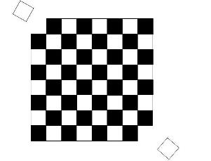

* **Anotācija:** Šeit aprakstām dažas spēles skolēnu telpiskās 
iztēles, kombinatorikas un matemātisko spriedumu 
(t.sk. neiespējamības pierādījumu) prasmju izkopšanai.
Materiāls domāts kvalificētiem lasītājiem - 
  skolotājiem un vecākiem, kuri vada nodarbības bērniem.
* (CC0) [Creative Commons](https://creativecommons.org/publicdomain/zero/1.0/deed.en). 
* Nesenākie labojumi: 2016-10-23. 

# Salikšanas spēles: Teorija

Ievērojams skaits matemātisku spēļu ir tās, 
kuru mērķis ir no vairākām plaknes vai telpas figūriņām 
salikt noteiktas formas lielāku figūru. Šādas spēles 
sauksim par *salikšanas spēlēm* (*assembly puzzles*). 
Vairumā gadījumu saliekamā figūra ir redzama zīmējumā, 
bet ir iespējami arī uzdevumi, kuros figūra nav parādīta, 
bet tai jāapmierina
noteiktas īpašības. (Tipiski piemēri ir salikt jebkādu 
                     simetrisku figūru vai arī salikt *dvīnītes* - sadalīt
                     12 dažādas pentomino detaļām divās grupās pa 6 detaļām tā, 
                     lai no abām grupām varētu salikt vienu un to pašu.)

Pārdošanā ir ievērojams skaits matemātisku rotaļlietu -
  to skaits mērāms tūkstošos. Diemžēl, lielākajai daļai 
no tām nav laba metodiskā materiāla, nav paskaidrojumu 
par to, kādus matemātikas jēdzienus, kādas domāšanas metodes
ar tām var izkopt. Šī materiāla nodoms ir izraudzīties
dažas rotaļlietas (pārsvarā tehniski vienkāršas), 
par kurām var izveidot pietiekami daudzveidīgus matemātiska
satura uzdevumus. 

## Piezīmes par didaktiku

Par matemātikas didaktikas mācīšanas niansēm būtu jāvaicā 
jaunāko klašu izglītības ekspertiem; šoreiz tikai dažas
piebildes, kas izriet no autoru pieredzes saistībā ar matemātikas 
pulciņiem (interešu izglītību, ko ir izvēlējušies paši bērni). 

* Matemātikas pulciņus, it īpaši jaunākajās klasēs, var vadīt 
cilvēki bez universitātes līmeņa izglītības matemātikā. Ir tomēr
svarīgi brīvi pārzināt matemātikas kursu dažus līmeņus tālāk, nekā
to mācām bērniem. Piemēram, ja bērniem ir uzdevumi par kvadrātiņiem un rūtiņām, 
tad skolotājam būtu jāzin Pitagora teorēma (un fakts, ka rūtiņas diagonāle ir 
                                            $\sqrt{2}$), pat ja bērniem par to nekas netiek teikts. 
* Būtiskas ir skolotāja pozitīvas emocijas saistībā ar matemātiku -
  t.i. viņa vai viņas interese mierīgi visu uzzināt, pacietīgi 
runāties ar bērniem arī tad, ja viņi par uzdevumu izsaka "muļķīgas" idejas.
* Ja kādam pieaugušajam matemātika skolas gados radīja negatīvas emocijas 
un stresu, tad labāk uzreiz nesākt strādāt ar bērniem. Var vispirms 
mēģināt iziet kādu savam līmenim atbilstošu tālmācības kursu par matemātiku (Edx, Coursera u.c.), 
lai pārliecinātos, vai negatīvās emocijas ir beigušās un matemātika izraisa
ziņkārību un mierīgu pārliecību.
* Dažreiz ir izdevīgāk sekot bērnu piedāvātajam domu gājienam, nekā 
visu laiku izvirzīt savus noteikumus. Bērnu spēlēšanās procesā 
pieaugušajam vēlams iesaistīties neuzmācīgi, toties reizēm 
palīdz, ja arī pieaugušais bērnu sarīkotā spēlē
pasaka kaut ko negaidītu vai "huligānisku", 
jo tas liek bērniem pārbaudīt pašiem savus pieņēmumus.
* Vērtīgākās matemātikas iemaņas ir prasme risināt 
nestandartus uzdevumus jeb problēmas. 
T.i. visu to, par ko sākotnēji nav zināms, 
vai un kā to var izdarīt. 
* Skolotāja uzdevums ir palīdzēt skolēniem (bez palīdzības 
                                            progress būs ļoti lēns), bet nedrīkst palīdzēt nepareizi vai par daudz. 
Ir jāzina, cik daudz vajag pateikt, lai skolēnam būtu interesanti turpināt 
saviem spēkiem. VAR un VAJAG piedāvāt "dabiskas", "universālas" idejas, 
kuras skolēnam varētu dabiski ienākt prātā arī pašam. 
Vērts atcerēties Sokratu (Platona dialogos), kurš sevi salīdzināja ar 
vecmāti, kas palīdz piedzimt patiesībai. 

## Tetromino un tetrakubi

* Plaknes figūras, ko veido vairāki vienādi kvadrāti, kas saskaras
ar malām, sauc par *polimino* (EN: [polyomino](https://en.wikipedia.org/wiki/Polyomino)). 
* Telpas figūras, ko veido vairāki vienādi kubiņi, kas 
saskaras ar skaldnēm, sauc par *polikubiem*.

Vienkāršākajos gadījumos figūriņu salikšana var 
mudināt bērnus saskaitīt kvadrātiņus un kubiņus, kas ļauj 
izdomāt, cik un kāda veida detaļas vajadzīgas, lai saliktu 
vajadzīgo figūriņu. Citos gadījumos kvadrātiņu vai kubiņu 
skaitīšana nepalīdz; ir vajadzīga kaut kāda dziļāka analīze. 
Ir divas noderīgas idejas, kuras laiku pa laikam var palīdzēt 
figūriņu salikšanā no detaļām. Tās ir *simetrija* un
*izkrāsošana* (matemātikā parasti to sauc par 
               *krāsošanas invariantiem*). 

## Simetrijas īpašības 

Gan detaļām, gan no tām saliktajām figūriņām 
var piemist *simetrija*. Bērni par to bieži neaizdomājas, 
bet simetrijai ir svarīgi zināt, kāda veida simetrija 
tā ir. Ir pavisam 3 simetrijas veidi: 
  
  * Simetrija pret centru. T.i. ir kāds punkts - *simetrijas centrs*, 
attiecībā pret kuru visi figūras elementi novietoti simetriski). 
Pats centrs var atrasties kādas rūtiņas vai kubiņa vidū vai arī 
būt uz stūrīša. Tas var pats piederēt aplūkojamai figūrai vai arī 
atrasties ārpus tās (teiksim, būt ``caurums''). 
Ja vien simetrijas centrs pats nav kubiņš vai kvadrātiņš, 
kas pieder figūriņai, tad simetrija pret centru nozīmē, 
ka figūriņā ir pāra skaits kubiņu/kvadrātiņu. Jo tos 
var sadalīt pa pāriem -- katru kopā ar viņa simetrisko attēlu.
Rāmītis no 8 rūtiņām ar tukšumu vidū ir centrāli simetrisks.  
* Simetrija pret asi vai plakni. T.i. ir kāds ``spogulis'', 
attiecībā pret kuru figūriņa atspoguļojas un paliek nemainīga). 
simetrija pret plakni, kas detaļu garenvirzienā sadala uz pusēm.
* Simetrija pret pagriezienu. T.i. ir kāds leņķis 
(piemēram, 90 grādi) un punkts ap kuru pagriezt - un figūriņa
pēc pagriešanas paliek nemainīga. Piemēram, simbols "+" (pluss)
paliek nemainīgs, ja to ap viduspunktu apveļ par 90 grādiem. 

## Simetrija: Piemēri

Kā telpas figūrām 
N-tetrakubiem (sk. 2.attēlu) nepiemīt *hiralitāte* (t.i. nepastāv iespēja 
                                                    tos sašķirot "kreisajos" un "labajos" kā dūrainīšus vai kurpes). 
Ar attiecīgu pagriešanu un pārbīdi 
(bet neizmantojot spoguļsimetriju) šīs detaļas 
var attēlot vienu par otru.
Savukārt, kā plaknes figūriņām N-tetromino 
piemīt hiralitāte (tāpat kā nav 
                   plaknes pagrieziena, kas lielo latīņu burtu "N" 
                   attēlotu par tā spoguļattēlu "И" - 
                     šāds attēlojums ir iespējams vienīgi, izmantojot trīsdimensiju telpu un 
                   apsviežot šo burtu kā piparkūku).

## Krāsošanas uzdevumi

Matemātikas teorijas zināšanas ir vajadzīgas visvairāk 
nevis tad, ja kaut ko VAR izdarīt (jo daudzreiz figūriņas
                                   var salikt uz labu laimi - pilnīgi bez matemātiskas analīzes), 
bet gan tad, ja kaut ko NEVAR izdarīt. 

Vienkāršākais pamatojums, kādēļ kaut ko nevar izdarīt ir 
analīze ar figūru laukumiem. Jaunāko klašu skolēni var nezināt
kas ir figūras laukums (dažādās valstīs taisnstūra laukuma
                        formulu māca dažādās klasēs). Tomēr arī pavisam maziem 
bērniem var ieteikt saskaitīt rūtiņas jeb kvadrātiņus. 
Ja, teiksim, figūras laukums ir 7 rūtiņas, tad to nevarēs
salikt no figūriņām, kuru laukums ir 2 rūtiņas. Vienkārši 
tādēļ, ka 7 nevar izteikt kā divnieku summu: trīs figūriņas
būs par maz ($3 \times 2 = 6$), bet četras figūriņās 
būs par daudz ($3 \times 2 = 8$). Tieši septiņas rūtiņas 
dabūt nav iespējams. 

Tomēr ir svarīgi apzināties, ka šī laukumu analīze 
(ja figūriņas laukums nedalās ar vienas detaļas laukumu)
ir *pietiekams* nosacījums, lai kaut ko nevarētu izdarīt, 
bet tā nav *nepieciešams* nosacījums. 

Klasisks piemērs ir uzdevums par izmainīto šaha galdiņu. 
Parastam $8 \times 8$ šaha galdiņam izgrieza divas rūtiņas
pretējos stūros. 
Vai atlikušo galdiņu (kurā ir 62 rūtiņas) var sagriezt 
taisnstūrīšos ar izmēriem $1 \times 2$ rūtiņas? 

7-9 gadus veciem bērniem var ieteikt sagriezt
šo figūru taisnstūrīšos $1 \times 2$ (neizkrāsotu melnajās un baltajās rūtiņās) 
- un pārliecināties, ka nekas nesanāk. 
(No otras puses - pietiek izgriezt stūra rūtiņas, kuras
  atrodas nevis pretī pa diagonāli, bet pie vienas malas - un 
  sagriešanu taisnstūrīšos $1 \times 2$ rūtiņas jau var veikt). 

10-12 gadu vecumā var jau pierādīt neiespējamību sagriezt. 
(Šādu pierādījumu viegli veikt, atsevišķi saskaitot 
  melnās un baltās rūtiņas. Ja abas izgrieztās rūtiņas ir 
  vienā krāsā, rodas melno un balto rūtiņu nelīdzsvars.)
Diez vai pavisam maziem bērniem ir piemēroti neiespējamības
pierādījumi; viņiem piemērotāk izzināt matemātiku empīriski; teiksim
mēģinot sagriezt taisnstūrīšos, kas dažreiz izdodas un citreiz nē.

## Krāsošanas uzdevumi: Piemēri

* No $8 \times 8$ kvadrāta izgriezta viena rūtiņa. 
Vai atlikušo laukumu no $63$ rūtiņām var sagriezt
taisnstūrīšos ar izmēriem $1 \times 3$. 
Arī šajā gadījumā ar laukumiem neko pamatot nevar
(jo 63 dalās ar 3). Bet var viegli pārliecināties, 
ka atkarībā no izgrieztās rūtiņas novietojuma, 
dažreiz sagriešanu 21 detaļās var veikt, citreiz - nevar. 

## Domāšanas metodes un heiristikas

Salikšanas spēļu uzdevumos ir svarīgi pamanīt tos 
analītiskās domāšanas metodes, kas var mums palīdzēt. 
*Domāšanas metodes* palīdz nonākt pie universāliem secinājumiem.
*Heiristikas* ir taktiski apsvērumi, kas ļauj ātrāk 
atrast "adatu siena kaudzē", piemēram, ļauj ātri salikt 
figūriņu no detaļām, kaut pilna variantu pārlase uz datora atklāj, ka 
būtu jāpārbauda tūkstošiem variantu. 

* Saskaitīt rūtiņas figūriņai un izmantojamām detaļām. 
* Apzināties, ka telpiskas figūriņas kopskats (izometriskais vai 
                                               kabineta projekcijā) parasti neparāda visas
tur esošās rūtiņas; reizēm rūtiņu skaitu jānoskaidro, izmantojot 
dalāmību. 
* Aizpildīšanu vēlams sākt vai nu no figūras "stūriem", kurus 
var aizpildīt tikai nedaudzos veidos, vai arī - ar lielākajām 
figūrām.
* Salikšanas spēļu galvenais uzsvars ir - spēja sistemātiski 
pārbaudīt variantus un atmest nederīgos. To var darīt 
vai nu ar iepriekš izplānotu variantu pārlasi, vai arī 
ar t.s. gadījumu koka apstaigāšanu jeb *backtracking* -- 
  t.i. mēģinām aizpildīt kaut kādā acīmredzamā veidā, ja tas neizdodas, 
tad dažas pēdējās detaļas noņem, mēģina citādi, utml. 

