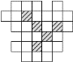
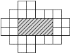

```{r, echo=FALSE}
library(grid)
library(RColorBrewer)

getArray <- function(dims, mma) {
  mm <- array(0,dim=dims)
  
  for (zz in 1:dims[3]) {
    for (yy in 1:dims[2]) {
      for (xx in 1:dims[1]) {
        cc <- substr(mma[zz],
                     (dims[2]-yy)*dims[1]+xx,
                     (dims[2]-yy)*dims[1]+xx)
        if (cc != ".") {
          mm[xx,yy,zz] <- as.numeric(cc)
        } else {
          mm[xx,yy,zz] <- -1
        }
      }
    }
  }
  return(mm)
}


# theC <- list("0" = "#ffffff", 
#              "1" = "#cccccc", 
#              "2" = "#28AE7B") 

ccol <- brewer.pal(8, "Set3")
theC <- list("0" = "#ffffff", "1" = "#cccccc")
for (jj in 1:8) {
  theC[[as.character(jj + 1)]] <- ccol[jj] 
}

#theC[["0""]] <- "#ffffff"


darken <- function(color, factor=1.4){
  col <- col2rgb(color)
  col <- col/factor
  col <- rgb(t(col), maxColorValue=255)
  col
}


lighten <- function(color, factor=1.4) {
    col <- col2rgb(color)
    col <- col*factor
    col <- rgb(t(as.matrix(apply(col, 1, function(x) if (x > 255) 255 else x))), maxColorValue=255)
    col
}

dimetric <- function(dims, mma, shaded) {

  mm <- getArray(dims,mma)
  cellsize <- 0.12
  dx <- 0.58
  dy <- 0.41
  Nx <- dim(mm)[1]
  Ny <- dim(mm)[2]
  Nz <- dim(mm)[3]
  
#   theGP <- list("1" = gpar(col = "black", fill="white", lwd = 1.5), 
#                 "2" = gpar(col = "black", fill="#28AE7B", lwd = 1.5))

#  theGP <- list("1" = gpar(col = "black", fill="white", lwd = 1.5), 
#                  "2" = gpar(col = "black", fill="#28AE7B", lwd = 1.5))

  for (zz in 1:Nz) {
    for (yy in 1:Ny) {
      for (xx in 1:Nx) {
        if (mm[xx,yy,zz] >= 0) {
          theType <- as.character(mm[xx,yy,zz])
          # pretskata kvadraatinjsh
          C1 <- theC[[as.character(mm[xx,yy,zz])]]
          gp1 <- gpar(col = "black", fill=C1, lwd = 1)
          grid.polygon(x = (c(xx-1,xx,xx,xx-1) + (Nz-zz)*dx)*cellsize, 
                       y = (c(yy-1,yy-1,yy,yy) + (Nz-zz)*dy)*cellsize, 
                       gp=gp1)
          # virsskata kvadraatinjsh
          if (shaded) {
            C2 = lighten(C1)
            gp2 <- gpar(col = "black", fill=C2, lwd = 1)
          } else {
            gp2 = gp1
          }
          grid.polygon(x = (c(xx-1,xx,xx+dx,xx-1+dx) + (Nz-zz)*dx)*cellsize, 
                       y = (c(yy,yy,yy+dy,yy+dy) + (Nz-zz)*dy)*cellsize, 
                       gp=gp2)
          # labaa saanskata kvadraatinjsh
          if (shaded) {
            C3 = darken(C1)
            gp3 <- gpar(col = "black", fill=C3, lwd = 1)
          } else {
            gp3 = gp1
          }
          grid.polygon(x = (c(xx,xx+dx,xx+dx,xx) + (Nz-zz)*dx)*cellsize, 
                       y = (c(yy-1,yy-1+dy,yy+dy,yy) + (Nz-zz)*dy)*cellsize, 
                       gp=gp3)
        }
      }
    }
  }
  
  pp <- recordPlot()
  return(pp)
  
}


isometric <- function(dims, mma, shaded) {
  mm <- getArray(dims,mma)
  cellsize <- 0.12
  Nx <- dim(mm)[1]
  Ny <- dim(mm)[2]
  Nz <- dim(mm)[3]
  alpha <- pi/7
  dx <- cos(alpha)
  dy <- sin(alpha)
  #dz <- 3/4
  
  if (shaded) {    
    theGP <- list("1" = gpar(col = "black", fill="white", lwd = 1.5), 
                  "2" = gpar(col = "black", fill="#dddddd", lwd = 1.5),
                  "3" = gpar(col = "black", fill="#bbbbbb", lwd = 1.5))
  } else {
    theGP <- list("1" = gpar(col = "black", fill="white", lwd = 1.5), 
                  "2" = gpar(col = "black", fill="#28AE7B", lwd = 1.5))
  }
  
  for (zz in 1:Nz) {
    for (yy in 1:Ny) {
      for (xx in 1:Nx) {
        if (mm[xx,yy,zz] > 0) {
          # pretskata kvadraatinjsh (skataas uz kreiso pusi)
          if (shaded) {
            gp1 <- theGP[["2"]]
          } else {
            gp1 <- theGP[[as.character(mm[xx,yy,zz])]]
          }
          grid.polygon(x = (c((xx-1)*dx,xx*dx,xx*dx,(xx-1)*dx)+(Nz-zz)*dx)*cellsize, 
                       y = (c(yy-1 + (Nx - xx + 1)*dy,
                              yy-1 + (Nx - xx)*dy,
                              yy + (Nx - xx)*dy,
                              yy + (Nx - xx + 1)*dy) + (Nz-zz)*dy)*cellsize, 
                       gp=gp1)
          # virsskata kvadraatinjsh   
          if (shaded) {
            gp2 <- theGP[["1"]]
          } else {
            gp2 <- theGP[[as.character(mm[xx,yy,zz])]]
          }
          grid.polygon(x = (c((xx-1)*dx,
                              xx*dx,
                              xx*dx+dx,
                              (xx-1)*dx+dx) + (Nz-zz)*dx)*cellsize, 
                       y = (c(yy + (Nx - xx + 1)*dy,
                              yy + (Nx - xx)*dy,
                              yy + (Nx - xx)*dy + dy,
                              yy + (Nx - xx + 1)*dy + dy) + (Nz-zz)*dy)*cellsize,
                       gp=gp2)
          # labaa saanskata kvadraatinjsh
          if (shaded) {
            gp3 <- theGP[["3"]]
          } else {
            gp3 <- theGP[[as.character(mm[xx,yy,zz])]]
          }
          grid.polygon(x = (c(xx*dx,xx*dx,xx*dx+dx,xx*dx+dx) + (Nz-zz)*dx)*cellsize, 
                       y = (c(yy-1 + (Nx - xx)*dy,
                              yy + (Nx - xx)*dy,
                              yy + (Nx - xx)*dy + dy,
                              yy-1 + (Nx - xx)*dy + dy) + (Nz-zz)*dy)*cellsize, 
                       gp=gp3)
                    
        }
      }
    }
  }
}
```


# Salikšanas spēļu prakse: 8 N-tetrakubi 

Spēles aprakstu 2003.gadā izveidoja Andrejs Cibulis (Andrejs.Cibulis@lu.lv).
Sākotnējais izplatītājs - SAF "Arnika un partneri" (Rīga, tel. +371 66748248). 
Spēli veido astoņas vienādas detaļas. Katra detaļa ir 
"tetrakubs" - no 4 vienādiem kubiņiem salikta figūriņa, 
kas atgādina lielo "N" burtu. 


## Spēle 8 N-tetrakubi: Teksta uzdevumi

Šajā sadaļā apkopojam "teksta uzdevumus", kas izmanto 
8 N-tetrakubus.

**1. uzdevums:** Salikt attēloto simetrisko torni. 

```{r, fig.width=5.4, fig.height=1.8, echo=FALSE}
mmaA <- c(
  paste("...",
        "...",
        "111",
        "111", sep=""),
  paste(".1.",
        ".11",
        "111",
        "111", sep=""),
  paste("...",
        ".1.",
        "111",
        "111", sep="")
)

grid.newpage()
vp1 <- viewport(x=0.2, y=0.5, width=0.3, height=0.9)
pushViewport(vp1)
#grid.rect()
isometric(c(3,4,3), mmaA, TRUE)
```


**2. uzdevums:** Zīmējumā parādīts stabils 
tornis (tāds, kas negāžas) ar
augstumu 4 "rūtiņas". Salikt no 2 detaļām augstāku torni, 
kura augstums joprojām ir vesels skaits rūtiņu. 

```{r, fig.width=5.4, fig.height=1.8, echo=FALSE}
mmaB <- c(
  paste(".2.",
        ".22",
        "002",
        ".00", sep="")
)

vp1 <- viewport(x=0.2, y=0.5, width=0.3, height=0.9)
pushViewport(vp1)
#grid.rect()
dimetric(c(3,4,1), mmaB,FALSE)
```


**3. uzdevums:**  Salikt no 2 detaļām vēl 
augstāku torni nekā iepriekšējā uzdevumā. 

**4. uzdevums:** No 4 detaļām izveidot 
*plakanu* (1 ``rūtiņu'' augstu) figūru, 
kurai ir 4 simetrijas asis. 

**5. uzdevums:**  Zīmējumā parādīts skats no augšas, 
kā ar 6 detaļām ierobežot 5 
izolētus kvadrātiņus. (Par *izolētiem* sauksim kvadrātiņus, 
no kuriem nevar aiziet uz citiem nepārklātiem kvadrātiņiem, 
šķērsojot tikai rūtiņu malas.)
Parādīt, kā salikt šo konfigurāciju. 



**6. uzdevums:**  Parādīt, kā ar 6 detaļām var 
ierobežot 6 izolētus kvadrātiņus.

**7. uzdevums:**  Zīmējumā ierobežots aploks ar laukumu 
8 ``rūtiņas''. 
Ierobežot ar 6 detļām aplokus attiecīgi ar šādiem laukumiem: 
9, 10, 11, 12, 13, 14 un 15. 
(*Aplokam* jābūt *sakarīgam* - no jebkuras rūtiņas uz jebkuru 
citu jāvar aiziet, šķērsojot tikai rūtiņu malas; tajā nedrīkst
būt izolēti gabali.)



**8. uzdevums:**  Izvietot 6 detaļas kastītē 
$3 \times 3 \times 3$. 

**9. uzdevums:** No 5 detaļām izveidot kādu jaunu simetrisku 
figūru, kuru var izvietot kastītē $3 \times 3 \times 3$. 
(Esošās figūras sk. zemāk sadaļā "No 5 figūrām"). 

**10. uzdevums:** No 8 detaļām salikt vissimetriskāko figūru. 
Tai būs vairāk nekā 8 simetrijas plaknes. 
(Esošās figūras sk. zemāk sadaļā "No 8 figūrām".)


## Salikt attēlotās figūras 

### No 2 detaļām


```{r, fig.width=5.4, fig.height=1.8, echo=FALSE}
mma2A <- c(
  paste(".11.",
        "1111", sep=""),
  paste("....",
        ".11.", sep="")
)


grid.newpage()
vp1 <- viewport(x=0.2, y=0.5, width=0.3, height=0.9)
pushViewport(vp1)
dimetric(c(4,2,2), mma2A,TRUE)
mma2B <- c(
  paste(".1.",
        "11.",
        "111", sep=""),
  paste("...",
        "...",
        "11.", sep="")
)

vp2 <- viewport(x=1.5, y=0.5, width=1, height=1)
pushViewport(vp2)
dimetric(c(3,3,2), mma2B,TRUE)
mma2C <- c(
  paste("11.",
        "11.", sep=""),
  paste(".11",
        ".11", sep="")
)
vp3 <- viewport(x=1.5, y=0.5, width=1, height=1)
pushViewport(vp3)
dimetric(c(3,2,2), mma2C,TRUE)
```


### No 3 detaļām

```{r, fig.width=5.4, fig.height=1.8, echo=FALSE}
mma3A <- c(
  paste(".11..",
        "1111.", sep=""),
  paste("..11.",
        ".1111", sep="")
)
grid.newpage()

vp1 <- viewport(x=0.2, y=0.5, width=0.3, height=0.9)
pushViewport(vp1)
dimetric(c(5,2,2), mma3A,TRUE)

mma3B <- c(
  paste("..11.",
        "1111.", sep=""),
  paste(".11..",
        ".1111", sep="")
)

vp2 <- viewport(x=1.5, y=0.5, width=1, height=1)
pushViewport(vp2)
dimetric(c(5,2,2), mma3B,TRUE)

mma3C <- c(
  paste("1..",
        "1.1",
        "111",sep=""),
  paste("..1",
        "1.1",
        "111", sep="")
)

vp3 <- viewport(x=1.5, y=0.5, width=1, height=1)
pushViewport(vp3)
dimetric(c(3,3,2), mma3C,TRUE)


grid.newpage()
mma3D <- c(
  paste("11.",
        "111",
        "111",sep=""),
  paste("...",
        "1..",
        "111", sep="")
)
pushViewport(vp1)
dimetric(c(3,3,2), mma3D,TRUE)

mma3E <- c(
  paste(".1.",
        ".11",
        "111",sep=""),
  paste(".1.",
        "11.",
        "111", sep="")
)

pushViewport(vp2)
dimetric(c(3,3,2), mma3E,TRUE)


mma3F <- c(
  paste("1.",
        "111",
        "11",
        "11",sep=""),
  paste("..",
        "1.",
        "1.",
        "11", sep=""),
  paste("..",
        "..",
        "..",
        "1.", sep="")
)

pushViewport(vp3)
dimetric(c(2,4,3), mma3F,TRUE)

```

### No 4 detaļām


```{r, fig.width=5.4, fig.height=1.8, echo=FALSE}
grid.newpage()
mma4A <- c(
  paste("111",
        "111", sep=""),
  paste("1.1",
        "1.1", sep=""),
  paste("111",
        "111", sep="")
)
pushViewport(vp1)
dimetric(c(3,2,3), mma4A,TRUE)

mma4B <- c(
  paste(".1111.",
        "111111", sep=""),
  paste("..11..",
        ".1111.", sep="")
)
pushViewport(vp2)
dimetric(c(6,2,2), mma4B,TRUE)

mma4C <- c(
  paste(".11.",
        "1111",
        "1111",sep=""),
  paste("....",
        ".11.",
        "1111", sep="")
)
pushViewport(vp3)
dimetric(c(4,3,2), mma4C,TRUE)
```

### No 5 detaļām


```{r, fig.width=5.4, fig.height=1.8, echo=FALSE}
grid.newpage()
mma5A <- c(
  paste("....",
        "111.",
        "1111", sep=""),
  paste("1...",
        "111.",
        "1111",sep=""),
  paste("....",
        "11..",
        "111.",sep="")
)
pushViewport(vp1)
dimetric(c(4,3,3), mma5A,TRUE)

mma5B <- c(
  paste("..1",
        "111",
        "111",
        "111",sep=""),
  paste("1..",
        "111",
        "111",
        "111", sep="")
)
pushViewport(vp2)
dimetric(c(3,4,2), mma5B,TRUE)

mma5C <- c(
  paste("1...",
        "111.",
        "1111",
        "1111", sep=""),
  paste("....",
        "1...",
        "111.",
        "1111", sep="")
)
pushViewport(vp3)
dimetric(c(4,4,2), mma5C,TRUE)


grid.newpage()
mma5D <- c(
  paste("...",
        "111", 
        "111",sep=""),
  paste(".11",
        "111",
        "111", sep=""),
  paste(".1.",
        "11.", 
        "111", sep="")
)
pushViewport(vp1)
dimetric(c(3,3,3), mma5D,TRUE)

mma5E <- c(
  paste(".1.",
        "111",
        "111", sep=""),
  paste("11.",
        "111",
        "111", sep=""),
  paste("...",
        "11.",
        "111", sep="")
)
pushViewport(vp2)
dimetric(c(3,3,3), mma5E,TRUE)

mma5F <- c(
  paste("11.",
        "111",
        "111",sep=""),
  paste("1..",
        "1.1",
        "111", sep=""),
  paste("...",
        "111",
        "111", sep="")
)
pushViewport(vp3)
dimetric(c(3,3,3), mma5F,TRUE)
```


### No 6 detaļām

```{r, fig.width=5.4, fig.height=1.8, echo=FALSE}
grid.newpage()
mma6A <- c(
  paste("1111",
        "1111", sep=""),
  paste("1111",
        "1111",
        "1111",sep=""),
  paste("1111",
        "1111",sep="")
)
pushViewport(vp1)
dimetric(c(4,2,3), mma6A,TRUE)

mma6B <- c(
  paste("....",
        "1111",
        "1111",sep=""),
  paste(".11.",
        "1111",
        "1111", sep=""),
  paste("....",
        ".11.",
        "1111", sep="")

)
pushViewport(vp2)
dimetric(c(4,3,3), mma6B,TRUE)

mma6C <- c(
  paste(".11.",
        "1111",
        "1111", sep=""),
  paste("....",
        ".11.",
        "1111", sep=""),
  paste("....",
        "1111",
        "1111", sep="")
)
pushViewport(vp3)
dimetric(c(4,3,3), mma6C,TRUE)


grid.newpage()
mma6D <- c(
  paste(".11.",
        "1111", 
        "1111",sep=""),
  paste(".11.",
        ".11.",
        "1111", sep=""),
  paste("....",
        ".11.", 
        "1111", sep="")
)
pushViewport(vp1)
dimetric(c(4,3,3), mma6D,TRUE)

mma6E <- c(
  paste(".11.",
        "1111",
        "1111", 
        "1111", sep=""),
  paste("....",
        ".11.",
        "1111",
        "1111", sep="")
)
pushViewport(vp2)
dimetric(c(4,4,2), mma6E,TRUE)

mma6F <- c(
  paste(".11.",
        ".11.",
        "1111",
        "1111",sep=""),
  paste("....",
        ".11.",
        "1111", 
        "1111", sep=""),
  paste("....",
        "....",
        "....",
        "1..1", sep="")
)
pushViewport(vp3)
dimetric(c(4,4,3), mma6F,TRUE)
```


```{r, fig.width=5.4, fig.height=1.8, echo=FALSE}
grid.newpage()
mma6G <- c(
  paste(".11.",
        "1111",
        "1111", sep=""),
  paste("....",
        ".11.",
        "1111",sep=""),
  paste("....",
        "1111",
        "1111", sep="")
)
pushViewport(vp1)
dimetric(c(4,3,3), mma6G,TRUE)

mma6H <- c(
  paste(".11.",
        "1111",
        "1111",sep=""),
  paste(".11.",
        ".11.",
        "1111", sep=""),
  paste("....",
        ".11.",
        "1111", sep="")

)
pushViewport(vp2)
dimetric(c(4,3,3), mma6H,TRUE)

mma6I <- c(
  paste("1..1",
        "1111",
        "1111", sep=""),
  paste("1..1",
        "1..1",
        "1111", sep=""),
  paste("....",
        "1..1",
        "1111", sep="")
)
pushViewport(vp3)
dimetric(c(4,3,3), mma6I,TRUE)
```


```{r, fig.width=5.4, fig.height=1.8, echo=FALSE}
grid.newpage()
mma6J <- c(
  paste(".11.",
        "1111", 
        "1111", 
        "1111", sep=""),
  paste("....",
        ".11.",
        ".11.",
        "1111", sep=""),
  paste("....",
        "....",
        "....",
        ".11.", sep="")
)
narrowVp1 <- viewport(x=0.15, y=0.5, width=0.3, height=0.9)
pushViewport(narrowVp1)
dimetric(c(4,4,3), mma6J,TRUE)


mma6K <- c(
  paste("...",
        ".1.",
        ".1.", 
        "111", 
        "111", sep=""),
  paste(".1.",
        ".1.",
        ".1.",
        "111", 
        "111", sep=""),
  paste("...",
        ".1.",
        ".1.",
        "111",
        "111", sep="")
)

narrowVp2 <- viewport(x=1.35, y=0.5, width=1, height=1)
pushViewport(narrowVp2)
dimetric(c(3,5,3), mma6K,TRUE)


mma6L <- c(
  paste("...",
        "1.1",
        "111", sep=""),
  paste("1.1",
        "1.1",
        "111", sep=""),
  paste("1.1",
        "1.1",
        "111", sep=""),
  paste("...",
        "1.1",
        "111", sep="")
)
narrowVp3 <- viewport(x=1.35, y=0.5, width=1, height=1)
pushViewport(narrowVp3)
dimetric(c(3,3,4), mma6L,TRUE)


mma6M <- c(
  paste(".1.",
        ".1.",
        ".1.", sep=""),
  paste("111",
        "111",
        "111", sep=""),
  paste("111",
        "111",
        "111", sep=""),
  paste(".1.",
        ".1.",
        ".1.", sep="")
)
narrowVp4 <- viewport(x=1.35, y=0.5, width=1, height=1)
pushViewport(narrowVp4)
dimetric(c(3,3,4), mma6M,TRUE)
```


```{r, fig.width=5.4, fig.height=1.8, echo=FALSE}
grid.newpage()
mma6N <- c(
  paste(".1111.",
        "111111",
        "111111", sep=""),
  paste("......",
        "..11..",
        "111111",sep="")
)
pushViewport(vp1)
dimetric(c(6,3,2), mma6N,TRUE)

mma6O <- c(
  paste("11..11",
        "111111",
        "111111",sep=""),
  paste("......",
        "1....1",
        "111111", sep="")
)
pushViewport(vp2)
dimetric(c(6,3,2), mma6O,TRUE)

mma6P <- c(
  paste(".11.",
        "1111",
        "1111",
        "1111", sep=""),
  paste("....",
        "....",
        "....",
        "1111", sep=""),
  paste("....",
        "....",
        "....",
        "1111", sep=""),
  paste("....",
        "....",
        "....",
        ".11.", sep="")
)
pushViewport(vp3)
dimetric(c(4,4,4), mma6P,TRUE)


grid.newpage()
mma6Q <- c(
  paste(".11.",
        "1111",
        "1111",
        "1111",
        "1111", sep=""),
  paste("....",
        "....",
        "....",
        "....",
        "1111",sep=""),
  paste("....",
        "....",
        "....",
        "....",
        ".11.", sep="")
)
pushViewport(vp1)
dimetric(c(4,5,3), mma6Q,TRUE)

mma6R <- c(
  paste("..11..",
        ".1111.",
        ".1111.",
        "111111",sep=""),
  paste("......",
        "..11..",
        "..11..", 
        ".1111.", sep="")
)
pushViewport(vp2)
dimetric(c(6,4,2), mma6R,TRUE)

mma6S <- c(
  paste("1..",
        "11.",
        "11.", 
        "1..", 
        "111", 
        "111", sep=""),
  paste("...",
        "1..", 
        "1..", 
        "...",
        "111",
        "111", sep=""),
  paste("...",
        "...",
        "...",
        "...",
        "11.",
        "11.", sep="")
)
pushViewport(vp3)
dimetric(c(3,6,3), mma6S,TRUE)

```

## No 7 detaļām 

```{r, fig.width=5.4, fig.height=1.8, echo=FALSE}
grid.newpage()
mma7A <- c(
  paste(".11",
        "111", 
        "111",
        "111",
        "111", sep=""),
  paste("11.",
        "111",
        "111",
        "111", 
        "111", sep="")
)
pushViewport(vp1)
dimetric(c(3,5,2), mma7A,TRUE)

mma7B <- c(
  paste("...",
        "111",
        "111", sep=""),
  paste("111",
        "111",
        "111", sep=""),
  paste("111",
        "1.1",
        "111", sep=""),
  paste("...",
        "1.1",
        "111", sep="")

)
pushViewport(vp2)
dimetric(c(3,3,4), mma7B,TRUE)

mma7C <- c(
  paste(".1.",
        ".1.",
        ".1.", 
        "111", 
        "111", sep=""),
  paste("...",
        ".1.",
        "111", 
        "111", 
        "111", sep=""),
  paste("...",
        "...",
        ".1.",
        ".1.",
        "111", sep=""),
  paste("...",
        "...",
        ".1.",
        "...",
        ".1.", sep="")
)
pushViewport(vp3)
dimetric(c(3,5,4), mma7C,TRUE)


grid.newpage()
mma7D <- c(
  paste("..11",
        "111.", 
        "111.",
        "111.", sep=""),
  paste("....",
        "..1.",
        "111.", 
        "111.", sep=""),
  paste("1...",
        "11..", 
        "111.",
        "111.", sep=""), 
  paste("1...",
        "....", 
        "....",
        "....", sep="")
)
pushViewport(vp1)
dimetric(c(4,4,4), mma7D,TRUE)

mma7E <- c(
  paste("...",
        "111",
        "111", 
        "111", sep=""),
  paste("..1",
        "111",
        "111",
        "111", sep=""),
  paste(".11",
        "11.",
        "111",
        "111", sep="")
)
pushViewport(vp2)
dimetric(c(3,4,3), mma7E,TRUE)

mma7F <- c(
  paste(".1.",
        "111",
        "111",
        "111",
        "111", sep=""),
  paste("1..",
        "1..",
        "1..", 
        "111", 
        "111", sep=""),
  paste("...",
        "1..",
        "1.1",
        "111", 
        "111", sep="")
)
pushViewport(vp3)
isometric(c(3,5,3), mma7F,TRUE)
```


### No 8 detaļām

```{r, fig.width=5.4, fig.height=1.8, echo=FALSE}
grid.newpage()
mma8A <- c(
  paste("1111",
        "1111", sep=""),
  paste("1111",
        "1111", sep=""),
  paste("1111",
        "1111", sep=""),
  paste("1111",
        "1111", sep="")
)
pushViewport(vp1)
dimetric(c(4,2,4), mma8A,TRUE)

mma8B <- c(
  paste(".11.",
        "1111",
        "1111", sep=""),
  paste("1111",
        "1111",
        "1111", sep=""),
  paste(".11.",
        "1111",
        "1111", sep="")

)
pushViewport(vp2)
dimetric(c(4,3,3), mma8B,TRUE)

mma8C <- c(
  paste(".1111.",
        "111111",
        "111111", sep=""),
  paste(".1111.",
        "111111",
        "111111", sep="")
)
pushViewport(vp3)
dimetric(c(6,3,2), mma8C,TRUE)


grid.newpage()
mma8D <- c(
  paste("11..11",
        "111111", 
        "111111", sep=""),
  paste("11..11",
        "111111",
        "111111", sep="")
)
pushViewport(vp1)
dimetric(c(6,3,2), mma8D,TRUE)

mma8E <- c(
  paste("....",
        "1111",
        "1111", sep=""),
  paste("1..1",
        "1..1",
        "1..1", sep=""),
  paste("1..1",
        "1..1",
        "1..1", sep=""),
  paste("....",
        "1111",
        "1111", sep="")
)
pushViewport(vp2)
dimetric(c(4,3,4), mma8E,TRUE)

mma8F <- c(
  paste(".11.",
        "1111",
        "1111", sep=""),
  paste(".11.",
        "1111",
        "1111", sep=""),
  paste("....",
        ".11.",
        "1111", sep=""),
  paste("....", 
        ".11.",
        "1111", sep="")
)
pushViewport(vp3)
dimetric(c(4,3,4), mma8F,TRUE)
```


```{r, fig.width=5.4, fig.height=1.8, echo=FALSE}
grid.newpage()
mma8G <- c(
  paste("111111",
        "111111", sep=""),
  paste("1..111",
        "111111", sep=""),
  paste("1..111",
        "111111", sep="")
)
pushViewport(vp1)
dimetric(c(6,2,3), mma8G,TRUE)

mma8H <- c(
  paste("..111",
        "..111", sep=""),
  paste("11111",
        "11111", sep=""),
  paste("11111",
        "11111", sep=""),
  paste("111..",
        "111..", sep="")
)
pushViewport(vp2)
dimetric(c(5,2,4), mma8H,TRUE)

mma8I <- c(
  paste("1111",
        "1111",
        "1111", sep=""),
  paste("1111",
        "1111",
        "1111", sep=""),
  paste("....",
        "1111",
        "1111", sep="")
)
pushViewport(vp3)
dimetric(c(4,3,3), mma8I,TRUE)


grid.newpage()
mma8J <- c(
  paste("....",
        "1111", 
        "1111", sep=""),
  paste("1..1",
        "1..1",
        "1..1", sep=""),
  paste("1..1",
        "1..1",
        "1..1", sep=""),
  paste("....",
        "1111",
        "1111", sep="")
)
pushViewport(vp1)
dimetric(c(4,3,4), mma8J,TRUE)

mma8K <- c(
  paste("111",
        "111",
        "111", sep=""),
  paste("111",
        "111",
        "111", sep=""),
  paste(".1.",
        "111",
        "111", sep=""),
  paste(".1.",
        "111",
        "111", sep="")
)
pushViewport(vp2)
dimetric(c(3,3,4), mma8K,TRUE)

mma8L <- c(
  paste("1..1",
        "1111",
        "1111",
        "1111", sep=""),
  paste("....",
        "1..1",
        "1111",
        "1111", sep=""),
  paste("....",
        "....",
        "1111",
        "1111", sep="")
)
pushViewport(vp3)
dimetric(c(4,4,3), mma8L,TRUE)
```


```{r, fig.width=5.4, fig.height=1.8, echo=FALSE}
grid.newpage()
mma8M <- c(
  paste("....",
        "....",
        "1111",
        "1111", sep=""),
  paste(".11.",
        "1111",
        "1111", 
        "1111", sep=""),
  paste("....",
        ".11.",
        "1111",
        "1111", sep="")
)
pushViewport(vp1)
dimetric(c(4,4,3), mma8M,TRUE)

mma8N <-  c(
  paste("....",
        "....",
        "1111",
        "1111", sep=""),
  paste("1..1",
        "1111",
        "1111", 
        "1111", sep=""),
  paste("....",
        "1..1",
        "1111",
        "1111", sep="")
)
pushViewport(vp2)
dimetric(c(4,4,3), mma8N,TRUE)

mma8O <- c(
  paste("..1..",
        "11111",
        "11111",
        "11111", sep=""),
  paste("..1..",
        "11111",
        "11111",
        "11111", sep="")
)
pushViewport(vp3)
dimetric(c(5,4,2), mma8O,TRUE)


grid.newpage()
mma8P <- c(
  paste(".11.",
        "1111", 
        "1111",
        "1111", sep=""),
  paste("....",
        ".11.",
        "1111",
        "1111", sep=""),
  paste("....",
        "....",
        ".11.",
        "1111", sep=""),
  paste("....",
        "....",
        "....",
        ".11.", sep="")
)
pushViewport(vp1)
dimetric(c(4,4,4), mma8P,TRUE)

mma8Q <- c(
  paste(".11.",
        "1111",
        "1111",
        "1111",
        "1111", 
        "1111", sep=""),
  paste("....",
        "....",
        "....",
        ".11.",
        ".11.",
        "1111", sep=""),
  paste("....",
        "....",
        "....",
        "....",
        "....",
        ".11.", sep="")
)
pushViewport(vp2)
dimetric(c(4,6,3), mma8Q,TRUE)

mma8R <- c(
  paste(".11.",
        "1111",
        "1111",
        "1111",
        "1111", 
        "1111", 
        "1111", sep=""),
  paste("....",
        "....",
        "....",
        "....",
        "....",
        ".11.",
        "1111", sep=""),
  paste("....",
        "....",
        "....",
        "....",
        "....",
        "....",
        ".11.", sep="")
)
pushViewport(vp3)
dimetric(c(4,7,3), mma8R,TRUE)
```


```{r, fig.width=5.4, fig.height=1.8, echo=FALSE}
grid.newpage()
mma8S <- c(
  paste("....",
        "....",
        "....",
        "1..1", sep=""),
  paste(".11.",
        "1111",
        "1111", 
        "1111", sep=""),
  paste(".11.",
        "1111",
        "1111", 
        "1111", sep=""),
  paste("....",
        "....",
        "....",
        "1..1", sep="")
)
pushViewport(vp1)
dimetric(c(4,4,4), mma8S,TRUE)

mma8T <-  c(
  paste("....",
        ".11.",
        "1111",
        "1111", sep=""),
  paste(".11.",
        "1111",
        "1111", 
        "1111", sep=""),
  paste("....",
        ".11.",
        "1111",
        ".11.", sep="")
)
pushViewport(vp2)
dimetric(c(4,4,3), mma8T,TRUE)

mma8U <- c(
  paste(".11.",
        "....",
        "....",
        ".11.", sep=""),
  paste("1111",
        ".11.",
        ".11.",
        "1111", sep=""),
  paste("1111",
        ".11.",
        ".11.",
        "1111", sep=""),
  paste(".11.",
        "....",
        "....",
        ".11.", sep="")
)
pushViewport(vp3)
dimetric(c(4,4,4), mma8U,TRUE)


grid.newpage()
mma8V <- c(
  paste(".11.",
        "1111",
        "1111", 
        "1111",
        "1111", sep=""),
  paste("....",
        "....",
        "1..1",
        "1..1",
        "1111", sep=""),
  paste("....",
        "....",
        "....",
        "1..1",
        "1111", sep="")
)
wideVp1 <- viewport(x=0.3, y=0.5, width=0.3, height=0.9)
pushViewport(wideVp1)
dimetric(c(4,5,3), mma8V,TRUE)

mma8W <- c(
  paste("1111.11.",
        "11111111",
        "1111.11.", sep=""),
  paste("1111....",
        "1111....", 
        "1111....", sep="")
)
wideVp2 <- viewport(x=1.75, y=0.5, width=1, height=1)
pushViewport(wideVp2)
dimetric(c(8,3,2), mma8W,TRUE)


grid.newpage()
mma8X <- c(
  paste(".11..11.",
        "11111111",
        ".11..11.", sep=""),
  paste(".11..11.",
        "11111111",
        ".11..11.", sep="")
)
wideVp1 <- viewport(x=0.3, y=0.5, width=0.3, height=0.9)
pushViewport(wideVp1)
dimetric(c(8,3,2), mma8X,TRUE)

mma8Y <- c(
  paste("1111111",
        "1.....1",
        "1111111", sep=""),
  paste("1111111",
        "1.....1",
        "1111111", sep="")
)
wideVp2 <- viewport(x=1.75, y=0.5, width=1, height=1)
pushViewport(wideVp2)
dimetric(c(7,3,2), mma8Y,TRUE)

```


## Atrisinājumi 

**1. uzdevums:** Šis ir viens no sarežģītākajiem 
piemēriem; ir jāaplūko dažādi pieņēmumi par 
torņa kopskatā neredzamajām rūtiņām. 

**2. uzdevums:** Daudziem risinātājiem šķiet, 
ka risinājums jāmeklē sabīdot kubiņus 
cieši kopā. Tad stabili nolikt
figūriņu neizdodas, jo N-tetramino, ja to noliek 
"uz gala", gāžas uz sāniem (masas centrs atrodas
N-tetramino pašā vidū un viegli pārveļas pāri 
atbalsta kvadrātam). Toties pietiek nedaudz pabīdīt 
augšējo N-tetramino uz sāniem, lai rastos 
stabila figūra (tiesa, ar caurumu vidū). 


**3. uzdevums:** Šoreiz ir vēl tālāk 
jāatkāpjas no "standarta" domāšanas paradumiem -
augšējo figūriņu attiecībā pret apakšējo jānovieto 
grūti nosakāmā leņķī, lai tā nenoslīdētu ne uz vienu, 
ne uz otru pusi. Pamatojaums, kādēļ šī figūra ir 
augstāka par 5 rūtiņām, izietu ārpus jaunāko klašu 
kursa (tas ir vidusskolas uzdevums, kas prasa arī 
fizikas zināšanas - kā atrast stabilu stāvokli augšējai 
detaļai). Tomēr praksē var pārliecināties, ka šāda figūriņa
ir nedaudz augstāka par iepriekšējā uzdevumā aplūkoto.


### No 2 detaļām 


```{r, fig.width=5.4, fig.height=1.8, echo=FALSE}
grid.newpage()
mms2A <- c(
  paste(".22.",
        "1122", sep=""),
  paste("....",
        ".11.", sep="")
)
pushViewport(vp1)
dimetric(c(4,2,2), mms2A,FALSE)

mms2B <- c(
  paste(".2.",
        "22.",
        "211", sep=""),
  paste("...",
        "...",
        "11.", sep="")
)
pushViewport(vp2)
dimetric(c(3,3,2), mms2B,FALSE)

mms2C <- c(
  paste("22.",
        "11.", sep=""),
  paste(".22",
        ".11", sep="")
)
pushViewport(vp3)
dimetric(c(3,2,2), mms2C,FALSE)
```


### No 3 detaļām 

```{r, fig.width=5.4, fig.height=1.8, echo=FALSE}
grid.newpage()
mms3A <- c(
  paste(".33..",
        "1122.", sep=""),
  paste("..33.",
        ".1122", sep="")
)
pushViewport(vp1)
dimetric(c(5,2,2), mms3A,FALSE)

mms3B <- c(
  paste("..33.",
        "1122.", sep=""),
  paste(".33..",
        ".1122", sep="")
)
pushViewport(vp2)
dimetric(c(5,2,2), mms3B,FALSE)

mms3C <- c(
  paste("2..",
        "2.3",
        "113", sep=""),
  paste("..3",
        "2.3",
        "211", sep="")
)
pushViewport(vp3)
dimetric(c(3,3,2), mms3C,FALSE)


grid.newpage()
mms3D <- c(
  paste("23.",
        "233",
        "113", sep=""),
  paste("...",
        "2..",
        "211", sep="")
)
pushViewport(vp1)
dimetric(c(3,3,2), mms3D,FALSE)

mms3E <- c(
  paste(".3.",
        ".33",
        "113", sep=""),
  paste(".2.",
        "22.",
        "211", sep="")
)
pushViewport(vp2)
dimetric(c(3,3,2), mms3E,FALSE)

mms3F <- c(
  paste("3.",
        "32",
        "22",
        "21", sep=""),
  paste("..",
        "3.",
        "3.", 
        "11", sep=""),
  paste("..",
        "..",
        "..",
        "3.", sep="")
)
pushViewport(vp3)
dimetric(c(2,4,3), mms3F,FALSE)

```


