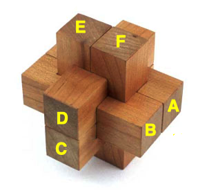

# Par krustiņiem

Šis ir nezinātnisks mēģinājums izmantot "backtracking" softu, lai saliktu rotaļlietu krustiņus. 



Katrai krustiņa detaļai iespējams ievietoties katrā no pozīcijām (A,B,C,D,E,F), 
turklāt tā var iegrozīties divos veidos. Ja, teiksim, pozīcijā A atrodas detaļa
CROSS01 (turklāt šīs detaļas labais gals sakrīt ar dzelteno burtu "A", tad 
to apzīmē `{'A': (CROSS01,0), ...}`). Savukārt, ja detaļas `CROSS01` kreisais gals
sakrīt ar dzelteno burtu "A", tad to apzīmē ar `{'A': (CROSS01,1), ...}`. 

Pavisam eksistē $6! \cdot 2^6 = 720 \cdot 64 = 46080$ veidi, kā sešās pozīcijās salikt sešas 
detaļas, starp kurām neviena nav simetriska pret apgriešanu otrādi 
un arī neviena nav vienāda ar kādu citu detaļu. 
(Visas sešu elementu permutācijas; turklāt katru detaļu var 
ievietot arī apgrieztu otrādi.)
Daudzi no tiem uzreiz jāatmet, jo detaļu kubiņi pārklājas (tādā veidā nevarētu 
detaļas salikt pat ar "teleportēšanu"). Starp tiem veidiem, kuros katrai 
detaļai pietiek vietas, ir daudz tādu, kurus faktiski nevar salikt jeb citiem 
vārdiem - ja šāds krustiņš kaut kā būtu izveidots, no tā nevarētu izvilkt pirmo detaļu. 

Programmā `burr_cross.py` krustiņu veido tādas sešas detaļas, ko var salikt ar "teleportēšanu"
$16512$ dažādos veidos tā, lai detaļas savstarpēji nepārklātos. Bet lielo 
vairumu no šiem variantiem būtu neiespējami izjaukt. Tātad arī neiespējami salikt no 
sešām atsevišķi stāvošām detaļām. 


```
FULL_CROSS = [
    [[3,3,3,3,3,3,3,3,3,3,3,3],
     [3,3,3,3,3,3,3,3,3,3,3,3]],
    [[3,3,3,3,1,0,0,1,3,3,3,3],
     [3,3,3,3,1,3,3,1,3,3,3,3]],
    [[3,3,3,3,1,0,0,3,3,3,3,3],
     [3,3,3,3,1,1,3,3,3,3,3,3]],
    [[3,3,3,3,1,1,1,1,3,3,3,3],
     [3,3,3,3,1,1,1,1,3,3,3,3]],
    [[3,3,3,3,1,1,1,1,3,3,3,3],
     [3,3,3,3,1,0,0,1,3,3,3,3]],
    [[3,3,3,3,3,0,0,1,3,3,3,3],
     [3,3,3,3,3,3,1,1,3,3,3,3]]
]

HARD_CROSS_A = [

    [[3, 3, 3, 3, 1, 2, 0, 1, 3, 3, 3, 3],
     [3, 3, 3, 3, 1, 3, 1, 1, 3, 3, 3, 3]],
    [[3, 3, 3, 3, 1, 0, 1, 1, 3, 3, 3, 3],
     [3, 3, 3, 3, 1, 1, 1, 1, 3, 3, 3, 3]],
    [[3, 3, 3, 3, 1, 1, 0, 1, 3, 3, 3, 3],
     [3, 3, 3, 3, 1, 1, 1, 1, 3, 3, 3, 3]],
     
    [[3, 3, 3, 3, 1, 1, 0, 1, 3, 3, 3, 3],
     [3, 3, 3, 3, 1, 1, 3, 1, 3, 3, 3, 3]],
    [[3, 3, 3, 3, 1, 1, 1, 1, 3, 3, 3, 3],
     [3, 3, 3, 3, 1, 3, 1, 1, 3, 3, 3, 3]],
    [[3, 3, 3, 3, 1, 1, 1, 1, 3, 3, 3, 3],
     [3, 3, 3, 3, 1, 1, 3, 1, 3, 3, 3, 3]]
]
```


**********  Move 0  **********
minX = -11, maxX = 11, minY = -11, maxY = 11, minZ = -11, maxZ = 11
   *** Level(11) ***
. . . . . . . . . . . . 
. . . . . . . . . . . . 
. . . . . . . . . . . . 
. . . . . . . . . . . . 
. . . . . . . . . . . . 
. . . . 5 5 6 6 . . . . 
. . . . 5 5 6 6 . . . . 
. . . . . . . . . . . . 
. . . . . . . . . . . . 
. . . . . . . . . . . . 
. . . . . . . . . . . . 
. . . . . . . . . . . . 
   *** Level(9) ***
. . . . . . . . . . . . 
. . . . . . . . . . . . 
. . . . . . . . . . . . 
. . . . . . . . . . . . 
. . . . . . . . . . . . 
. . . . 5 5 6 6 . . . . 
. . . . 5 5 6 6 . . . . 
. . . . . . . . . . . . 
. . . . . . . . . . . . 
. . . . . . . . . . . . 
. . . . . . . . . . . . 
. . . . . . . . . . . . 
   *** Level(7) ***
. . . . . . . . . . . . 
. . . . . . . . . . . . 
. . . . . . . . . . . . 
. . . . . . . . . . . . 
. . . . . . . . . . . . 
. . . . 5 5 6 6 . . . . 
. . . . 5 5 6 6 . . . . 
. . . . . . . . . . . . 
. . . . . . . . . . . . 
. . . . . . . . . . . . 
. . . . . . . . . . . . 
. . . . . . . . . . . . 
   *** Level(5) ***
. . . . . . . . . . . . 
. . . . . . . . . . . . 
. . . . . . . . . . . . 
. . . . . . . . . . . . 
. . . . . . . . . . . . 
. . . . 5 5 6 6 . . . . 
. . . . 5 5 6 6 . . . . 
. . . . . . . . . . . . 
. . . . . . . . . . . . 
. . . . . . . . . . . . 
. . . . . . . . . . . . 
. . . . . . . . . . . . 
   *** Level(3) ***
. . . . . 3 3 . . . . . 
. . . . . 3 3 . . . . . 
. . . . . 3 3 . . . . . 
. . . . . 3 3 . . . . . 
. . . . . 3 3 . . . . . 
. . . . 5 3 . 6 . . . . 
. . . . 5 3 3 6 . . . . 
. . . . . 3 3 . . . . . 
. . . . . 3 3 . . . . . 
. . . . . 3 3 . . . . . 
. . . . . 3 3 . . . . . 
. . . . . 3 3 . . . . . 
   *** Level(1) ***
. . . . . 3 3 . . . . . 
. . . . . 3 3 . . . . . 
. . . . . 3 3 . . . . . 
. . . . . 3 3 . . . . . 
1 1 1 1 1 1 1 1 1 1 1 1 
1 1 1 1 5 . 1 6 1 1 1 1 
4 4 4 4 5 . 6 6 4 4 4 4 
4 4 4 4 4 . 4 4 4 4 4 4 
. . . . . 3 3 . . . . . 
. . . . . 3 3 . . . . . 
. . . . . 3 3 . . . . . 
. . . . . 3 3 . . . . . 
   *** Level(-1) ***
. . . . . 2 2 . . . . . 
. . . . . 2 2 . . . . . 
. . . . . 2 2 . . . . . 
. . . . . 2 2 . . . . . 
1 1 1 1 1 . . 1 1 1 1 1 
1 1 1 1 5 5 1 6 1 1 1 1 
4 4 4 4 5 4 . 6 4 4 4 4 
4 4 4 4 4 4 4 4 4 4 4 4 
. . . . . 2 2 . . . . . 
. . . . . 2 2 . . . . . 
. . . . . 2 2 . . . . . 
. . . . . 2 2 . . . . . 
   *** Level(-3) ***
. . . . . 2 2 . . . . . 
. . . . . 2 2 . . . . . 
. . . . . 2 2 . . . . . 
. . . . . 2 2 . . . . . 
. . . . . 2 2 . . . . . 
. . . . 5 2 . 6 . . . . 
. . . . 5 2 2 6 . . . . 
. . . . . 2 2 . . . . . 
. . . . . 2 2 . . . . . 
. . . . . 2 2 . . . . . 
. . . . . 2 2 . . . . . 
. . . . . 2 2 . . . . . 
   *** Level(-5) ***
. . . . . . . . . . . . 
. . . . . . . . . . . . 
. . . . . . . . . . . . 
. . . . . . . . . . . . 
. . . . . . . . . . . . 
. . . . 5 5 6 6 . . . . 
. . . . 5 5 6 6 . . . . 
. . . . . . . . . . . . 
. . . . . . . . . . . . 
. . . . . . . . . . . . 
. . . . . . . . . . . . 
. . . . . . . . . . . . 
   *** Level(-7) ***
. . . . . . . . . . . . 
. . . . . . . . . . . . 
. . . . . . . . . . . . 
. . . . . . . . . . . . 
. . . . . . . . . . . . 
. . . . 5 5 6 6 . . . . 
. . . . 5 5 6 6 . . . . 
. . . . . . . . . . . . 
. . . . . . . . . . . . 
. . . . . . . . . . . . 
. . . . . . . . . . . . 
. . . . . . . . . . . . 
   *** Level(-9) ***
. . . . . . . . . . . . 
. . . . . . . . . . . . 
. . . . . . . . . . . . 
. . . . . . . . . . . . 
. . . . . . . . . . . . 
. . . . 5 5 6 6 . . . . 
. . . . 5 5 6 6 . . . . 
. . . . . . . . . . . . 
. . . . . . . . . . . . 
. . . . . . . . . . . . 
. . . . . . . . . . . . 
. . . . . . . . . . . . 
   *** Level(-11) ***
. . . . . . . . . . . . 
. . . . . . . . . . . . 
. . . . . . . . . . . . 
. . . . . . . . . . . . 
. . . . . . . . . . . . 
. . . . 5 5 6 6 . . . . 
. . . . 5 5 6 6 . . . . 
. . . . . . . . . . . . 
. . . . . . . . . . . . 
. . . . . . . . . . . . 
. . . . . . . . . . . . 
. . . . . . . . . . . . 
Cubes found = 240

**********  Move 1  **********
minX = -11, maxX = 11, minY = -11, maxY = 11, minZ = -11, maxZ = 11
   *** Level(11) ***
. . . . . . . . . . . . 
. . . . . . . . . . . . 
. . . . . . . . . . . . 
. . . . . . . . . . . . 
. . . . . . . . . . . . 
. . . . 5 5 6 6 . . . . 
. . . . 5 5 6 6 . . . . 
. . . . . . . . . . . . 
. . . . . . . . . . . . 
. . . . . . . . . . . . 
. . . . . . . . . . . . 
. . . . . . . . . . . . 
   *** Level(9) ***
. . . . . . . . . . . . 
. . . . . . . . . . . . 
. . . . . . . . . . . . 
. . . . . . . . . . . . 
. . . . . . . . . . . . 
. . . . 5 5 6 6 . . . . 
. . . . 5 5 6 6 . . . . 
. . . . . . . . . . . . 
. . . . . . . . . . . . 
. . . . . . . . . . . . 
. . . . . . . . . . . . 
. . . . . . . . . . . . 
   *** Level(7) ***
. . . . . . . . . . . . 
. . . . . . . . . . . . 
. . . . . . . . . . . . 
. . . . . . . . . . . . 
. . . . . . . . . . . . 
. . . . 5 5 6 6 . . . . 
. . . . 5 5 6 6 . . . . 
. . . . . . . . . . . . 
. . . . . . . . . . . . 
. . . . . . . . . . . . 
. . . . . . . . . . . . 
. . . . . . . . . . . . 
   *** Level(5) ***
. . . . . . . . . . . . 
. . . . . . . . . . . . 
. . . . . . . . . . . . 
. . . . . . . . . . . . 
. . . . . . . . . . . . 
. . . . 5 5 6 6 . . . . 
. . . . 5 5 6 6 . . . . 
. . . . . . . . . . . . 
. . . . . . . . . . . . 
. . . . . . . . . . . . 
. . . . . . . . . . . . 
. . . . . . . . . . . . 
   *** Level(3) ***
. . . . . 3 3 . . . . . 
. . . . . 3 3 . . . . . 
. . . . . 3 3 . . . . . 
. . . . . 3 3 . . . . . 
. . . . . 3 3 . . . . . 
. . . . 5 3 . 6 . . . . 
. . . . 5 3 3 6 . . . . 
. . . . . 3 3 . . . . . 
. . . . . 3 3 . . . . . 
. . . . . 3 3 . . . . . 
. . . . . 3 3 . . . . . 
. . . . . 3 3 . . . . . 
   *** Level(1) ***
. . . . . 3 3 . . . . . 
. . . . . 3 3 . . . . . 
. . . . . 3 3 . . . . . 
. . . . . 3 3 . . . . . 
. . . . . . . . . . . . 
. . . . 5 . . 6 . . . . 
4 4 4 4 5 . 6 6 4 4 4 4 
4 4 4 4 4 . 4 4 4 4 4 4 
. . . . . 3 3 . . . . . 
. . . . . 3 3 . . . . . 
. . . . . 3 3 . . . . . 
. . . . . 3 3 . . . . . 
   *** Level(-1) ***
. . . . . 2 2 . . . . . 
. . . . . 2 2 . . . . . 
. . . . . 2 2 . . . . . 
. . . . . 2 2 . . . . . 
1 1 1 1 1 1 1 1 1 1 1 1 
1 1 1 1 5 5 1 6 1 1 1 1 
4 4 4 4 5 4 . 6 4 4 4 4 
4 4 4 4 4 4 4 4 4 4 4 4 
. . . . . 2 2 . . . . . 
. . . . . 2 2 . . . . . 
. . . . . 2 2 . . . . . 
. . . . . 2 2 . . . . . 
   *** Level(-3) ***
. . . . . 2 2 . . . . . 
. . . . . 2 2 . . . . . 
. . . . . 2 2 . . . . . 
. . . . . 2 2 . . . . . 
1 1 1 1 1 2 2 1 1 1 1 1 
1 1 1 1 5 2 1 6 1 1 1 1 
. . . . 5 2 2 6 . . . . 
. . . . . 2 2 . . . . . 
. . . . . 2 2 . . . . . 
. . . . . 2 2 . . . . . 
. . . . . 2 2 . . . . . 
. . . . . 2 2 . . . . . 
   *** Level(-5) ***
. . . . . . . . . . . . 
. . . . . . . . . . . . 
. . . . . . . . . . . . 
. . . . . . . . . . . . 
. . . . . . . . . . . . 
. . . . 5 5 6 6 . . . . 
. . . . 5 5 6 6 . . . . 
. . . . . . . . . . . . 
. . . . . . . . . . . . 
. . . . . . . . . . . . 
. . . . . . . . . . . . 
. . . . . . . . . . . . 
   *** Level(-7) ***
. . . . . . . . . . . . 
. . . . . . . . . . . . 
. . . . . . . . . . . . 
. . . . . . . . . . . . 
. . . . . . . . . . . . 
. . . . 5 5 6 6 . . . . 
. . . . 5 5 6 6 . . . . 
. . . . . . . . . . . . 
. . . . . . . . . . . . 
. . . . . . . . . . . . 
. . . . . . . . . . . . 
. . . . . . . . . . . . 
   *** Level(-9) ***
. . . . . . . . . . . . 
. . . . . . . . . . . . 
. . . . . . . . . . . . 
. . . . . . . . . . . . 
. . . . . . . . . . . . 
. . . . 5 5 6 6 . . . . 
. . . . 5 5 6 6 . . . . 
. . . . . . . . . . . . 
. . . . . . . . . . . . 
. . . . . . . . . . . . 
. . . . . . . . . . . . 
. . . . . . . . . . . . 
   *** Level(-11) ***
. . . . . . . . . . . . 
. . . . . . . . . . . . 
. . . . . . . . . . . . 
. . . . . . . . . . . . 
. . . . . . . . . . . . 
. . . . 5 5 6 6 . . . . 
. . . . 5 5 6 6 . . . . 
. . . . . . . . . . . . 
. . . . . . . . . . . . 
. . . . . . . . . . . . 
. . . . . . . . . . . . 
. . . . . . . . . . . . 
Cubes found = 240

**********  Move 2  **********
minX = -11, maxX = 11, minY = -11, maxY = 13, minZ = -11, maxZ = 11
   *** Level(11) ***
. . . . . . . . . . . . 
. . . . . . . . . . . . 
. . . . . . . . . . . . 
. . . . . . . . . . . . 
. . . . . . . . . . . . 
. . . . 5 5 6 6 . . . . 
. . . . 5 5 6 6 . . . . 
. . . . . . . . . . . . 
. . . . . . . . . . . . 
. . . . . . . . . . . . 
. . . . . . . . . . . . 
. . . . . . . . . . . . 
. . . . . . . . . . . . 
   *** Level(9) ***
. . . . . . . . . . . . 
. . . . . . . . . . . . 
. . . . . . . . . . . . 
. . . . . . . . . . . . 
. . . . . . . . . . . . 
. . . . 5 5 6 6 . . . . 
. . . . 5 5 6 6 . . . . 
. . . . . . . . . . . . 
. . . . . . . . . . . . 
. . . . . . . . . . . . 
. . . . . . . . . . . . 
. . . . . . . . . . . . 
. . . . . . . . . . . . 
   *** Level(7) ***
. . . . . . . . . . . . 
. . . . . . . . . . . . 
. . . . . . . . . . . . 
. . . . . . . . . . . . 
. . . . . . . . . . . . 
. . . . 5 5 6 6 . . . . 
. . . . 5 5 6 6 . . . . 
. . . . . . . . . . . . 
. . . . . . . . . . . . 
. . . . . . . . . . . . 
. . . . . . . . . . . . 
. . . . . . . . . . . . 
. . . . . . . . . . . . 
   *** Level(5) ***
. . . . . . . . . . . . 
. . . . . . . . . . . . 
. . . . . . . . . . . . 
. . . . . . . . . . . . 
. . . . . . . . . . . . 
. . . . 5 5 6 6 . . . . 
. . . . 5 5 6 6 . . . . 
. . . . . . . . . . . . 
. . . . . . . . . . . . 
. . . . . . . . . . . . 
. . . . . . . . . . . . 
. . . . . . . . . . . . 
. . . . . . . . . . . . 
   *** Level(3) ***
. . . . . . . . . . . . 
. . . . . 3 3 . . . . . 
. . . . . 3 3 . . . . . 
. . . . . 3 3 . . . . . 
. . . . . 3 3 . . . . . 
. . . . 5 3 3 6 . . . . 
. . . . 5 3 . 6 . . . . 
. . . . . 3 3 . . . . . 
. . . . . 3 3 . . . . . 
. . . . . 3 3 . . . . . 
. . . . . 3 3 . . . . . 
. . . . . 3 3 . . . . . 
. . . . . 3 3 . . . . . 
   *** Level(1) ***
. . . . . . . . . . . . 
. . . . . 3 3 . . . . . 
. . . . . 3 3 . . . . . 
. . . . . 3 3 . . . . . 
. . . . . 3 3 . . . . . 
. . . . 5 . . 6 . . . . 
4 4 4 4 5 . 6 6 4 4 4 4 
4 4 4 4 4 . 4 4 4 4 4 4 
. . . . . . . . . . . . 
. . . . . 3 3 . . . . . 
. . . . . 3 3 . . . . . 
. . . . . 3 3 . . . . . 
. . . . . 3 3 . . . . . 
   *** Level(-1) ***
. . . . . 2 2 . . . . . 
. . . . . 2 2 . . . . . 
. . . . . 2 2 . . . . . 
. . . . . 2 2 . . . . . 
1 1 1 1 1 1 1 1 1 1 1 1 
1 1 1 1 5 5 1 6 1 1 1 1 
4 4 4 4 5 4 . 6 4 4 4 4 
4 4 4 4 4 4 4 4 4 4 4 4 
. . . . . 2 2 . . . . . 
. . . . . 2 2 . . . . . 
. . . . . 2 2 . . . . . 
. . . . . 2 2 . . . . . 
. . . . . . . . . . . . 
   *** Level(-3) ***
. . . . . 2 2 . . . . . 
. . . . . 2 2 . . . . . 
. . . . . 2 2 . . . . . 
. . . . . 2 2 . . . . . 
1 1 1 1 1 2 2 1 1 1 1 1 
1 1 1 1 5 2 1 6 1 1 1 1 
. . . . 5 2 2 6 . . . . 
. . . . . 2 2 . . . . . 
. . . . . 2 2 . . . . . 
. . . . . 2 2 . . . . . 
. . . . . 2 2 . . . . . 
. . . . . 2 2 . . . . . 
. . . . . . . . . . . . 
   *** Level(-5) ***
. . . . . . . . . . . . 
. . . . . . . . . . . . 
. . . . . . . . . . . . 
. . . . . . . . . . . . 
. . . . . . . . . . . . 
. . . . 5 5 6 6 . . . . 
. . . . 5 5 6 6 . . . . 
. . . . . . . . . . . . 
. . . . . . . . . . . . 
. . . . . . . . . . . . 
. . . . . . . . . . . . 
. . . . . . . . . . . . 
. . . . . . . . . . . . 
   *** Level(-7) ***
. . . . . . . . . . . . 
. . . . . . . . . . . . 
. . . . . . . . . . . . 
. . . . . . . . . . . . 
. . . . . . . . . . . . 
. . . . 5 5 6 6 . . . . 
. . . . 5 5 6 6 . . . . 
. . . . . . . . . . . . 
. . . . . . . . . . . . 
. . . . . . . . . . . . 
. . . . . . . . . . . . 
. . . . . . . . . . . . 
. . . . . . . . . . . . 
   *** Level(-9) ***
. . . . . . . . . . . . 
. . . . . . . . . . . . 
. . . . . . . . . . . . 
. . . . . . . . . . . . 
. . . . . . . . . . . . 
. . . . 5 5 6 6 . . . . 
. . . . 5 5 6 6 . . . . 
. . . . . . . . . . . . 
. . . . . . . . . . . . 
. . . . . . . . . . . . 
. . . . . . . . . . . . 
. . . . . . . . . . . . 
. . . . . . . . . . . . 
   *** Level(-11) ***
. . . . . . . . . . . . 
. . . . . . . . . . . . 
. . . . . . . . . . . . 
. . . . . . . . . . . . 
. . . . . . . . . . . . 
. . . . 5 5 6 6 . . . . 
. . . . 5 5 6 6 . . . . 
. . . . . . . . . . . . 
. . . . . . . . . . . . 
. . . . . . . . . . . . 
. . . . . . . . . . . . 
. . . . . . . . . . . . 
. . . . . . . . . . . . 
Cubes found = 240

**********  Move 3  **********
minX = -11, maxX = 11, minY = -11, maxY = 15, minZ = -11, maxZ = 11
   *** Level(11) ***
. . . . . . . . . . . . 
. . . . . . . . . . . . 
. . . . . . . . . . . . 
. . . . . . . . . . . . 
. . . . . . . . . . . . 
. . . . 5 5 6 6 . . . . 
. . . . 5 5 6 6 . . . . 
. . . . . . . . . . . . 
. . . . . . . . . . . . 
. . . . . . . . . . . . 
. . . . . . . . . . . . 
. . . . . . . . . . . . 
. . . . . . . . . . . . 
. . . . . . . . . . . . 
   *** Level(9) ***
. . . . . . . . . . . . 
. . . . . . . . . . . . 
. . . . . . . . . . . . 
. . . . . . . . . . . . 
. . . . . . . . . . . . 
. . . . 5 5 6 6 . . . . 
. . . . 5 5 6 6 . . . . 
. . . . . . . . . . . . 
. . . . . . . . . . . . 
. . . . . . . . . . . . 
. . . . . . . . . . . . 
. . . . . . . . . . . . 
. . . . . . . . . . . . 
. . . . . . . . . . . . 
   *** Level(7) ***
. . . . . . . . . . . . 
. . . . . . . . . . . . 
. . . . . . . . . . . . 
. . . . . . . . . . . . 
. . . . . . . . . . . . 
. . . . 5 5 6 6 . . . . 
. . . . 5 5 6 6 . . . . 
. . . . . . . . . . . . 
. . . . . . . . . . . . 
. . . . . . . . . . . . 
. . . . . . . . . . . . 
. . . . . . . . . . . . 
. . . . . . . . . . . . 
. . . . . . . . . . . . 
   *** Level(5) ***
. . . . . . . . . . . . 
. . . . . . . . . . . . 
. . . . . . . . . . . . 
. . . . . . . . . . . . 
. . . . . . . . . . . . 
. . . . 5 5 6 6 . . . . 
. . . . 5 5 6 6 . . . . 
. . . . . . . . . . . . 
. . . . . . . . . . . . 
. . . . . . . . . . . . 
. . . . . . . . . . . . 
. . . . . . . . . . . . 
. . . . . . . . . . . . 
. . . . . . . . . . . . 
   *** Level(3) ***
. . . . . . . . . . . . 
. . . . . . . . . . . . 
. . . . . 3 3 . . . . . 
. . . . . 3 3 . . . . . 
. . . . . 3 3 . . . . . 
. . . . 5 3 3 6 . . . . 
. . . . 5 3 3 6 . . . . 
. . . . . 3 . . . . . . 
. . . . . 3 3 . . . . . 
. . . . . 3 3 . . . . . 
. . . . . 3 3 . . . . . 
. . . . . 3 3 . . . . . 
. . . . . 3 3 . . . . . 
. . . . . 3 3 . . . . . 
   *** Level(1) ***
. . . . . . . . . . . . 
. . . . . . . . . . . . 
. . . . . 3 3 . . . . . 
. . . . . 3 3 . . . . . 
. . . . . 3 3 . . . . . 
. . . . 5 3 3 6 . . . . 
4 4 4 4 5 . 6 6 4 4 4 4 
4 4 4 4 4 . 4 4 4 4 4 4 
. . . . . . . . . . . . 
. . . . . . . . . . . . 
. . . . . 3 3 . . . . . 
. . . . . 3 3 . . . . . 
. . . . . 3 3 . . . . . 
. . . . . 3 3 . . . . . 
   *** Level(-1) ***
. . . . . 2 2 . . . . . 
. . . . . 2 2 . . . . . 
. . . . . 2 2 . . . . . 
. . . . . 2 2 . . . . . 
1 1 1 1 1 1 1 1 1 1 1 1 
1 1 1 1 5 5 1 6 1 1 1 1 
4 4 4 4 5 4 . 6 4 4 4 4 
4 4 4 4 4 4 4 4 4 4 4 4 
. . . . . 2 2 . . . . . 
. . . . . 2 2 . . . . . 
. . . . . 2 2 . . . . . 
. . . . . 2 2 . . . . . 
. . . . . . . . . . . . 
. . . . . . . . . . . . 
   *** Level(-3) ***
. . . . . 2 2 . . . . . 
. . . . . 2 2 . . . . . 
. . . . . 2 2 . . . . . 
. . . . . 2 2 . . . . . 
1 1 1 1 1 2 2 1 1 1 1 1 
1 1 1 1 5 2 1 6 1 1 1 1 
. . . . 5 2 2 6 . . . . 
. . . . . 2 2 . . . . . 
. . . . . 2 2 . . . . . 
. . . . . 2 2 . . . . . 
. . . . . 2 2 . . . . . 
. . . . . 2 2 . . . . . 
. . . . . . . . . . . . 
. . . . . . . . . . . . 
   *** Level(-5) ***
. . . . . . . . . . . . 
. . . . . . . . . . . . 
. . . . . . . . . . . . 
. . . . . . . . . . . . 
. . . . . . . . . . . . 
. . . . 5 5 6 6 . . . . 
. . . . 5 5 6 6 . . . . 
. . . . . . . . . . . . 
. . . . . . . . . . . . 
. . . . . . . . . . . . 
. . . . . . . . . . . . 
. . . . . . . . . . . . 
. . . . . . . . . . . . 
. . . . . . . . . . . . 
   *** Level(-7) ***
. . . . . . . . . . . . 
. . . . . . . . . . . . 
. . . . . . . . . . . . 
. . . . . . . . . . . . 
. . . . . . . . . . . . 
. . . . 5 5 6 6 . . . . 
. . . . 5 5 6 6 . . . . 
. . . . . . . . . . . . 
. . . . . . . . . . . . 
. . . . . . . . . . . . 
. . . . . . . . . . . . 
. . . . . . . . . . . . 
. . . . . . . . . . . . 
. . . . . . . . . . . . 
   *** Level(-9) ***
. . . . . . . . . . . . 
. . . . . . . . . . . . 
. . . . . . . . . . . . 
. . . . . . . . . . . . 
. . . . . . . . . . . . 
. . . . 5 5 6 6 . . . . 
. . . . 5 5 6 6 . . . . 
. . . . . . . . . . . . 
. . . . . . . . . . . . 
. . . . . . . . . . . . 
. . . . . . . . . . . . 
. . . . . . . . . . . . 
. . . . . . . . . . . . 
. . . . . . . . . . . . 
   *** Level(-11) ***
. . . . . . . . . . . . 
. . . . . . . . . . . . 
. . . . . . . . . . . . 
. . . . . . . . . . . . 
. . . . . . . . . . . . 
. . . . 5 5 6 6 . . . . 
. . . . 5 5 6 6 . . . . 
. . . . . . . . . . . . 
. . . . . . . . . . . . 
. . . . . . . . . . . . 
. . . . . . . . . . . . 
. . . . . . . . . . . . 
. . . . . . . . . . . . 
. . . . . . . . . . . . 
Cubes found = 240

**********  Move 4  **********
minX = -11, maxX = 11, minY = -11, maxY = 15, minZ = -11, maxZ = 11
   *** Level(11) ***
. . . . . . . . . . . . 
. . . . . . . . . . . . 
. . . . . . . . . . . . 
. . . . . . . . . . . . 
. . . . . . . . . . . . 
. . . . 5 5 6 6 . . . . 
. . . . 5 5 6 6 . . . . 
. . . . . . . . . . . . 
. . . . . . . . . . . . 
. . . . . . . . . . . . 
. . . . . . . . . . . . 
. . . . . . . . . . . . 
. . . . . . . . . . . . 
. . . . . . . . . . . . 
   *** Level(9) ***
. . . . . . . . . . . . 
. . . . . . . . . . . . 
. . . . . . . . . . . . 
. . . . . . . . . . . . 
. . . . . . . . . . . . 
. . . . 5 5 6 6 . . . . 
. . . . 5 5 6 6 . . . . 
. . . . . . . . . . . . 
. . . . . . . . . . . . 
. . . . . . . . . . . . 
. . . . . . . . . . . . 
. . . . . . . . . . . . 
. . . . . . . . . . . . 
. . . . . . . . . . . . 
   *** Level(7) ***
. . . . . . . . . . . . 
. . . . . . . . . . . . 
. . . . . . . . . . . . 
. . . . . . . . . . . . 
. . . . . . . . . . . . 
. . . . 5 5 6 6 . . . . 
. . . . 5 5 6 6 . . . . 
. . . . . . . . . . . . 
. . . . . . . . . . . . 
. . . . . . . . . . . . 
. . . . . . . . . . . . 
. . . . . . . . . . . . 
. . . . . . . . . . . . 
. . . . . . . . . . . . 
   *** Level(5) ***
. . . . . . . . . . . . 
. . . . . . . . . . . . 
. . . . . . . . . . . . 
. . . . . . . . . . . . 
. . . . . . . . . . . . 
. . . . 5 5 6 6 . . . . 
. . . . 5 5 6 6 . . . . 
. . . . . . . . . . . . 
. . . . . . . . . . . . 
. . . . . . . . . . . . 
. . . . . . . . . . . . 
. . . . . . . . . . . . 
. . . . . . . . . . . . 
. . . . . . . . . . . . 
   *** Level(3) ***
. . . . . . . . . . . . 
. . . . . . . . . . . . 
. . . . . 3 3 . . . . . 
. . . . . 3 3 . . . . . 
. . . . . 3 3 . . . . . 
. . . . 5 3 3 6 . . . . 
4 4 4 4 5 3 3 6 4 4 4 4 
4 4 4 4 4 3 4 4 4 4 4 4 
. . . . . 3 3 . . . . . 
. . . . . 3 3 . . . . . 
. . . . . 3 3 . . . . . 
. . . . . 3 3 . . . . . 
. . . . . 3 3 . . . . . 
. . . . . 3 3 . . . . . 
   *** Level(1) ***
. . . . . . . . . . . . 
. . . . . . . . . . . . 
. . . . . 3 3 . . . . . 
. . . . . 3 3 . . . . . 
. . . . . 3 3 . . . . . 
. . . . 5 3 3 6 . . . . 
4 4 4 4 5 4 6 6 4 4 4 4 
4 4 4 4 4 4 4 4 4 4 4 4 
. . . . . . . . . . . . 
. . . . . . . . . . . . 
. . . . . 3 3 . . . . . 
. . . . . 3 3 . . . . . 
. . . . . 3 3 . . . . . 
. . . . . 3 3 . . . . . 
   *** Level(-1) ***
. . . . . 2 2 . . . . . 
. . . . . 2 2 . . . . . 
. . . . . 2 2 . . . . . 
. . . . . 2 2 . . . . . 
1 1 1 1 1 1 1 1 1 1 1 1 
1 1 1 1 5 5 1 6 1 1 1 1 
. . . . 5 . . 6 . . . . 
. . . . . . . . . . . . 
. . . . . 2 2 . . . . . 
. . . . . 2 2 . . . . . 
. . . . . 2 2 . . . . . 
. . . . . 2 2 . . . . . 
. . . . . . . . . . . . 
. . . . . . . . . . . . 
   *** Level(-3) ***
. . . . . 2 2 . . . . . 
. . . . . 2 2 . . . . . 
. . . . . 2 2 . . . . . 
. . . . . 2 2 . . . . . 
1 1 1 1 1 2 2 1 1 1 1 1 
1 1 1 1 5 2 1 6 1 1 1 1 
. . . . 5 2 2 6 . . . . 
. . . . . 2 2 . . . . . 
. . . . . 2 2 . . . . . 
. . . . . 2 2 . . . . . 
. . . . . 2 2 . . . . . 
. . . . . 2 2 . . . . . 
. . . . . . . . . . . . 
. . . . . . . . . . . . 
   *** Level(-5) ***
. . . . . . . . . . . . 
. . . . . . . . . . . . 
. . . . . . . . . . . . 
. . . . . . . . . . . . 
. . . . . . . . . . . . 
. . . . 5 5 6 6 . . . . 
. . . . 5 5 6 6 . . . . 
. . . . . . . . . . . . 
. . . . . . . . . . . . 
. . . . . . . . . . . . 
. . . . . . . . . . . . 
. . . . . . . . . . . . 
. . . . . . . . . . . . 
. . . . . . . . . . . . 
   *** Level(-7) ***
. . . . . . . . . . . . 
. . . . . . . . . . . . 
. . . . . . . . . . . . 
. . . . . . . . . . . . 
. . . . . . . . . . . . 
. . . . 5 5 6 6 . . . . 
. . . . 5 5 6 6 . . . . 
. . . . . . . . . . . . 
. . . . . . . . . . . . 
. . . . . . . . . . . . 
. . . . . . . . . . . . 
. . . . . . . . . . . . 
. . . . . . . . . . . . 
. . . . . . . . . . . . 
   *** Level(-9) ***
. . . . . . . . . . . . 
. . . . . . . . . . . . 
. . . . . . . . . . . . 
. . . . . . . . . . . . 
. . . . . . . . . . . . 
. . . . 5 5 6 6 . . . . 
. . . . 5 5 6 6 . . . . 
. . . . . . . . . . . . 
. . . . . . . . . . . . 
. . . . . . . . . . . . 
. . . . . . . . . . . . 
. . . . . . . . . . . . 
. . . . . . . . . . . . 
. . . . . . . . . . . . 
   *** Level(-11) ***
. . . . . . . . . . . . 
. . . . . . . . . . . . 
. . . . . . . . . . . . 
. . . . . . . . . . . . 
. . . . . . . . . . . . 
. . . . 5 5 6 6 . . . . 
. . . . 5 5 6 6 . . . . 
. . . . . . . . . . . . 
. . . . . . . . . . . . 
. . . . . . . . . . . . 
. . . . . . . . . . . . 
. . . . . . . . . . . . 
. . . . . . . . . . . . 
. . . . . . . . . . . . 
Cubes found = 240

**********  Move 5  **********
minX = -11, maxX = 11, minY = -13, maxY = 15, minZ = -11, maxZ = 11
   *** Level(11) ***
. . . . . . . . . . . . 
. . . . . . . . . . . . 
. . . . . . . . . . . . 
. . . . . . . . . . . . 
. . . . . . . . . . . . 
. . . . . . . . . . . . 
. . . . 5 5 6 6 . . . . 
. . . . 5 5 6 6 . . . . 
. . . . . . . . . . . . 
. . . . . . . . . . . . 
. . . . . . . . . . . . 
. . . . . . . . . . . . 
. . . . . . . . . . . . 
. . . . . . . . . . . . 
. . . . . . . . . . . . 
   *** Level(9) ***
. . . . . . . . . . . . 
. . . . . . . . . . . . 
. . . . . . . . . . . . 
. . . . . . . . . . . . 
. . . . . . . . . . . . 
. . . . . . . . . . . . 
. . . . 5 5 6 6 . . . . 
. . . . 5 5 6 6 . . . . 
. . . . . . . . . . . . 
. . . . . . . . . . . . 
. . . . . . . . . . . . 
. . . . . . . . . . . . 
. . . . . . . . . . . . 
. . . . . . . . . . . . 
. . . . . . . . . . . . 
   *** Level(7) ***
. . . . . . . . . . . . 
. . . . . . . . . . . . 
. . . . . . . . . . . . 
. . . . . . . . . . . . 
. . . . . . . . . . . . 
. . . . . . . . . . . . 
. . . . 5 5 6 6 . . . . 
. . . . 5 5 6 6 . . . . 
. . . . . . . . . . . . 
. . . . . . . . . . . . 
. . . . . . . . . . . . 
. . . . . . . . . . . . 
. . . . . . . . . . . . 
. . . . . . . . . . . . 
. . . . . . . . . . . . 
   *** Level(5) ***
. . . . . . . . . . . . 
. . . . . . . . . . . . 
. . . . . . . . . . . . 
. . . . . . . . . . . . 
. . . . . . . . . . . . 
. . . . . . . . . . . . 
. . . . 5 5 6 6 . . . . 
. . . . 5 5 6 6 . . . . 
. . . . . . . . . . . . 
. . . . . . . . . . . . 
. . . . . . . . . . . . 
. . . . . . . . . . . . 
. . . . . . . . . . . . 
. . . . . . . . . . . . 
. . . . . . . . . . . . 
   *** Level(3) ***
. . . . . . . . . . . . 
. . . . . . . . . . . . 
. . . . . . . . . . . . 
. . . . . 3 3 . . . . . 
. . . . . 3 3 . . . . . 
. . . . . 3 3 . . . . . 
. . . . 5 3 3 6 . . . . 
4 4 4 4 5 3 3 6 4 4 4 4 
4 4 4 4 4 3 4 4 4 4 4 4 
. . . . . 3 3 . . . . . 
. . . . . 3 3 . . . . . 
. . . . . 3 3 . . . . . 
. . . . . 3 3 . . . . . 
. . . . . 3 3 . . . . . 
. . . . . 3 3 . . . . . 
   *** Level(1) ***
. . . . . . . . . . . . 
. . . . . . . . . . . . 
. . . . . . . . . . . . 
. . . . . 3 3 . . . . . 
. . . . . 3 3 . . . . . 
. . . . . 3 3 . . . . . 
. . . . 5 3 3 6 . . . . 
4 4 4 4 5 4 6 6 4 4 4 4 
4 4 4 4 4 4 4 4 4 4 4 4 
. . . . . . . . . . . . 
. . . . . . . . . . . . 
. . . . . 3 3 . . . . . 
. . . . . 3 3 . . . . . 
. . . . . 3 3 . . . . . 
. . . . . 3 3 . . . . . 
   *** Level(-1) ***
. . . . . 2 2 . . . . . 
. . . . . 2 2 . . . . . 
. . . . . 2 2 . . . . . 
. . . . . 2 2 . . . . . 
1 1 1 1 1 1 1 1 1 1 1 1 
1 1 1 1 . . 1 . 1 1 1 1 
. . . . 5 5 . 6 . . . . 
. . . . 5 . . 6 . . . . 
. . . . . 2 2 . . . . . 
. . . . . 2 2 . . . . . 
. . . . . 2 2 . . . . . 
. . . . . 2 2 . . . . . 
. . . . . . . . . . . . 
. . . . . . . . . . . . 
. . . . . . . . . . . . 
   *** Level(-3) ***
. . . . . 2 2 . . . . . 
. . . . . 2 2 . . . . . 
. . . . . 2 2 . . . . . 
. . . . . 2 2 . . . . . 
1 1 1 1 1 2 2 1 1 1 1 1 
1 1 1 1 . 2 1 . 1 1 1 1 
. . . . 5 2 2 6 . . . . 
. . . . 5 2 2 6 . . . . 
. . . . . 2 2 . . . . . 
. . . . . 2 2 . . . . . 
. . . . . 2 2 . . . . . 
. . . . . 2 2 . . . . . 
. . . . . . . . . . . . 
. . . . . . . . . . . . 
. . . . . . . . . . . . 
   *** Level(-5) ***
. . . . . . . . . . . . 
. . . . . . . . . . . . 
. . . . . . . . . . . . 
. . . . . . . . . . . . 
. . . . . . . . . . . . 
. . . . . . . . . . . . 
. . . . 5 5 6 6 . . . . 
. . . . 5 5 6 6 . . . . 
. . . . . . . . . . . . 
. . . . . . . . . . . . 
. . . . . . . . . . . . 
. . . . . . . . . . . . 
. . . . . . . . . . . . 
. . . . . . . . . . . . 
. . . . . . . . . . . . 
   *** Level(-7) ***
. . . . . . . . . . . . 
. . . . . . . . . . . . 
. . . . . . . . . . . . 
. . . . . . . . . . . . 
. . . . . . . . . . . . 
. . . . . . . . . . . . 
. . . . 5 5 6 6 . . . . 
. . . . 5 5 6 6 . . . . 
. . . . . . . . . . . . 
. . . . . . . . . . . . 
. . . . . . . . . . . . 
. . . . . . . . . . . . 
. . . . . . . . . . . . 
. . . . . . . . . . . . 
. . . . . . . . . . . . 
   *** Level(-9) ***
. . . . . . . . . . . . 
. . . . . . . . . . . . 
. . . . . . . . . . . . 
. . . . . . . . . . . . 
. . . . . . . . . . . . 
. . . . . . . . . . . . 
. . . . 5 5 6 6 . . . . 
. . . . 5 5 6 6 . . . . 
. . . . . . . . . . . . 
. . . . . . . . . . . . 
. . . . . . . . . . . . 
. . . . . . . . . . . . 
. . . . . . . . . . . . 
. . . . . . . . . . . . 
. . . . . . . . . . . . 
   *** Level(-11) ***
. . . . . . . . . . . . 
. . . . . . . . . . . . 
. . . . . . . . . . . . 
. . . . . . . . . . . . 
. . . . . . . . . . . . 
. . . . . . . . . . . . 
. . . . 5 5 6 6 . . . . 
. . . . 5 5 6 6 . . . . 
. . . . . . . . . . . . 
. . . . . . . . . . . . 
. . . . . . . . . . . . 
. . . . . . . . . . . . 
. . . . . . . . . . . . 
. . . . . . . . . . . . 
. . . . . . . . . . . . 
Cubes found = 240

**********  Move 6  **********
minX = -11, maxX = 11, minY = -13, maxY = 15, minZ = -11, maxZ = 11
   *** Level(11) ***
. . . . . . . . . . . . 
. . . . . . . . . . . . 
. . . . . . . . . . . . 
. . . . . . . . . . . . 
. . . . . . . . . . . . 
. . . . 5 5 . . . . . . 
. . . . 5 5 6 6 . . . . 
. . . . . . 6 6 . . . . 
. . . . . . . . . . . . 
. . . . . . . . . . . . 
. . . . . . . . . . . . 
. . . . . . . . . . . . 
. . . . . . . . . . . . 
. . . . . . . . . . . . 
. . . . . . . . . . . . 
   *** Level(9) ***
. . . . . . . . . . . . 
. . . . . . . . . . . . 
. . . . . . . . . . . . 
. . . . . . . . . . . . 
. . . . . . . . . . . . 
. . . . 5 5 . . . . . . 
. . . . 5 5 6 6 . . . . 
. . . . . . 6 6 . . . . 
. . . . . . . . . . . . 
. . . . . . . . . . . . 
. . . . . . . . . . . . 
. . . . . . . . . . . . 
. . . . . . . . . . . . 
. . . . . . . . . . . . 
. . . . . . . . . . . . 
   *** Level(7) ***
. . . . . . . . . . . . 
. . . . . . . . . . . . 
. . . . . . . . . . . . 
. . . . . . . . . . . . 
. . . . . . . . . . . . 
. . . . 5 5 . . . . . . 
. . . . 5 5 6 6 . . . . 
. . . . . . 6 6 . . . . 
. . . . . . . . . . . . 
. . . . . . . . . . . . 
. . . . . . . . . . . . 
. . . . . . . . . . . . 
. . . . . . . . . . . . 
. . . . . . . . . . . . 
. . . . . . . . . . . . 
   *** Level(5) ***
. . . . . . . . . . . . 
. . . . . . . . . . . . 
. . . . . . . . . . . . 
. . . . . . . . . . . . 
. . . . . . . . . . . . 
. . . . 5 5 . . . . . . 
. . . . 5 5 6 6 . . . . 
. . . . . . 6 6 . . . . 
. . . . . . . . . . . . 
. . . . . . . . . . . . 
. . . . . . . . . . . . 
. . . . . . . . . . . . 
. . . . . . . . . . . . 
. . . . . . . . . . . . 
. . . . . . . . . . . . 
   *** Level(3) ***
. . . . . . . . . . . . 
. . . . . . . . . . . . 
. . . . . . . . . . . . 
. . . . . 3 3 . . . . . 
. . . . . 3 3 . . . . . 
. . . . 5 3 3 . . . . . 
. . . . 5 3 3 6 . . . . 
4 4 4 4 . 3 3 6 4 4 4 4 
4 4 4 4 4 3 4 4 4 4 4 4 
. . . . . 3 3 . . . . . 
. . . . . 3 3 . . . . . 
. . . . . 3 3 . . . . . 
. . . . . 3 3 . . . . . 
. . . . . 3 3 . . . . . 
. . . . . 3 3 . . . . . 
   *** Level(1) ***
. . . . . . . . . . . . 
. . . . . . . . . . . . 
. . . . . . . . . . . . 
. . . . . 3 3 . . . . . 
. . . . . 3 3 . . . . . 
. . . . 5 3 3 . . . . . 
. . . . 5 3 3 6 . . . . 
4 4 4 4 . 4 6 6 4 4 4 4 
4 4 4 4 4 4 4 4 4 4 4 4 
. . . . . . . . . . . . 
. . . . . . . . . . . . 
. . . . . 3 3 . . . . . 
. . . . . 3 3 . . . . . 
. . . . . 3 3 . . . . . 
. . . . . 3 3 . . . . . 
   *** Level(-1) ***
. . . . . 2 2 . . . . . 
. . . . . 2 2 . . . . . 
. . . . . 2 2 . . . . . 
. . . . . 2 2 . . . . . 
1 1 1 1 1 1 1 1 1 1 1 1 
1 1 1 1 5 5 1 . 1 1 1 1 
. . . . 5 . . 6 . . . . 
. . . . . . . 6 . . . . 
. . . . . 2 2 . . . . . 
. . . . . 2 2 . . . . . 
. . . . . 2 2 . . . . . 
. . . . . 2 2 . . . . . 
. . . . . . . . . . . . 
. . . . . . . . . . . . 
. . . . . . . . . . . . 
   *** Level(-3) ***
. . . . . 2 2 . . . . . 
. . . . . 2 2 . . . . . 
. . . . . 2 2 . . . . . 
. . . . . 2 2 . . . . . 
1 1 1 1 1 2 2 1 1 1 1 1 
1 1 1 1 5 2 1 . 1 1 1 1 
. . . . 5 2 2 6 . . . . 
. . . . . 2 2 6 . . . . 
. . . . . 2 2 . . . . . 
. . . . . 2 2 . . . . . 
. . . . . 2 2 . . . . . 
. . . . . 2 2 . . . . . 
. . . . . . . . . . . . 
. . . . . . . . . . . . 
. . . . . . . . . . . . 
   *** Level(-5) ***
. . . . . . . . . . . . 
. . . . . . . . . . . . 
. . . . . . . . . . . . 
. . . . . . . . . . . . 
. . . . . . . . . . . . 
. . . . 5 5 . . . . . . 
. . . . 5 5 6 6 . . . . 
. . . . . . 6 6 . . . . 
. . . . . . . . . . . . 
. . . . . . . . . . . . 
. . . . . . . . . . . . 
. . . . . . . . . . . . 
. . . . . . . . . . . . 
. . . . . . . . . . . . 
. . . . . . . . . . . . 
   *** Level(-7) ***
. . . . . . . . . . . . 
. . . . . . . . . . . . 
. . . . . . . . . . . . 
. . . . . . . . . . . . 
. . . . . . . . . . . . 
. . . . 5 5 . . . . . . 
. . . . 5 5 6 6 . . . . 
. . . . . . 6 6 . . . . 
. . . . . . . . . . . . 
. . . . . . . . . . . . 
. . . . . . . . . . . . 
. . . . . . . . . . . . 
. . . . . . . . . . . . 
. . . . . . . . . . . . 
. . . . . . . . . . . . 
   *** Level(-9) ***
. . . . . . . . . . . . 
. . . . . . . . . . . . 
. . . . . . . . . . . . 
. . . . . . . . . . . . 
. . . . . . . . . . . . 
. . . . 5 5 . . . . . . 
. . . . 5 5 6 6 . . . . 
. . . . . . 6 6 . . . . 
. . . . . . . . . . . . 
. . . . . . . . . . . . 
. . . . . . . . . . . . 
. . . . . . . . . . . . 
. . . . . . . . . . . . 
. . . . . . . . . . . . 
. . . . . . . . . . . . 
   *** Level(-11) ***
. . . . . . . . . . . . 
. . . . . . . . . . . . 
. . . . . . . . . . . . 
. . . . . . . . . . . . 
. . . . . . . . . . . . 
. . . . 5 5 . . . . . . 
. . . . 5 5 6 6 . . . . 
. . . . . . 6 6 . . . . 
. . . . . . . . . . . . 
. . . . . . . . . . . . 
. . . . . . . . . . . . 
. . . . . . . . . . . . 
. . . . . . . . . . . . 
. . . . . . . . . . . . 
. . . . . . . . . . . . 
Cubes found = 240

**********  Move 7  **********
minX = -11, maxX = 11, minY = -15, maxY = 15, minZ = -11, maxZ = 11
   *** Level(11) ***
. . . . . . . . . . . . 
. . . . . . . . . . . . 
. . . . . . . . . . . . 
. . . . . . . . . . . . 
. . . . . . . . . . . . 
. . . . . . . . . . . . 
. . . . 5 5 . . . . . . 
. . . . 5 5 6 6 . . . . 
. . . . . . 6 6 . . . . 
. . . . . . . . . . . . 
. . . . . . . . . . . . 
. . . . . . . . . . . . 
. . . . . . . . . . . . 
. . . . . . . . . . . . 
. . . . . . . . . . . . 
. . . . . . . . . . . . 
   *** Level(9) ***
. . . . . . . . . . . . 
. . . . . . . . . . . . 
. . . . . . . . . . . . 
. . . . . . . . . . . . 
. . . . . . . . . . . . 
. . . . . . . . . . . . 
. . . . 5 5 . . . . . . 
. . . . 5 5 6 6 . . . . 
. . . . . . 6 6 . . . . 
. . . . . . . . . . . . 
. . . . . . . . . . . . 
. . . . . . . . . . . . 
. . . . . . . . . . . . 
. . . . . . . . . . . . 
. . . . . . . . . . . . 
. . . . . . . . . . . . 
   *** Level(7) ***
. . . . . . . . . . . . 
. . . . . . . . . . . . 
. . . . . . . . . . . . 
. . . . . . . . . . . . 
. . . . . . . . . . . . 
. . . . . . . . . . . . 
. . . . 5 5 . . . . . . 
. . . . 5 5 6 6 . . . . 
. . . . . . 6 6 . . . . 
. . . . . . . . . . . . 
. . . . . . . . . . . . 
. . . . . . . . . . . . 
. . . . . . . . . . . . 
. . . . . . . . . . . . 
. . . . . . . . . . . . 
. . . . . . . . . . . . 
   *** Level(5) ***
. . . . . . . . . . . . 
. . . . . . . . . . . . 
. . . . . . . . . . . . 
. . . . . . . . . . . . 
. . . . . . . . . . . . 
. . . . . . . . . . . . 
. . . . 5 5 . . . . . . 
. . . . 5 5 6 6 . . . . 
. . . . . . 6 6 . . . . 
. . . . . . . . . . . . 
. . . . . . . . . . . . 
. . . . . . . . . . . . 
. . . . . . . . . . . . 
. . . . . . . . . . . . 
. . . . . . . . . . . . 
. . . . . . . . . . . . 
   *** Level(3) ***
. . . . . . . . . . . . 
. . . . . . . . . . . . 
. . . . . . . . . . . . 
. . . . . . . . . . . . 
. . . . . 3 3 . . . . . 
. . . . . 3 3 . . . . . 
. . . . 5 3 3 . . . . . 
. . . . 5 3 3 6 . . . . 
4 4 4 4 . 3 3 6 4 4 4 4 
4 4 4 4 4 3 4 4 4 4 4 4 
. . . . . 3 3 . . . . . 
. . . . . 3 3 . . . . . 
. . . . . 3 3 . . . . . 
. . . . . 3 3 . . . . . 
. . . . . 3 3 . . . . . 
. . . . . 3 3 . . . . . 
   *** Level(1) ***
. . . . . . . . . . . . 
. . . . . . . . . . . . 
. . . . . . . . . . . . 
. . . . . . . . . . . . 
. . . . . 3 3 . . . . . 
. . . . . 3 3 . . . . . 
. . . . 5 3 3 . . . . . 
. . . . 5 3 3 6 . . . . 
4 4 4 4 . 4 6 6 4 4 4 4 
4 4 4 4 4 4 4 4 4 4 4 4 
. . . . . . . . . . . . 
. . . . . . . . . . . . 
. . . . . 3 3 . . . . . 
. . . . . 3 3 . . . . . 
. . . . . 3 3 . . . . . 
. . . . . 3 3 . . . . . 
   *** Level(-1) ***
. . . . . 2 2 . . . . . 
. . . . . 2 2 . . . . . 
. . . . . 2 2 . . . . . 
. . . . . 2 2 . . . . . 
1 1 1 1 1 1 1 1 1 1 1 1 
1 1 1 1 . . 1 . 1 1 1 1 
. . . . 5 5 . . . . . . 
. . . . 5 . . 6 . . . . 
. . . . . 2 2 6 . . . . 
. . . . . 2 2 . . . . . 
. . . . . 2 2 . . . . . 
. . . . . 2 2 . . . . . 
. . . . . . . . . . . . 
. . . . . . . . . . . . 
. . . . . . . . . . . . 
. . . . . . . . . . . . 
   *** Level(-3) ***
. . . . . 2 2 . . . . . 
. . . . . 2 2 . . . . . 
. . . . . 2 2 . . . . . 
. . . . . 2 2 . . . . . 
1 1 1 1 1 2 2 1 1 1 1 1 
1 1 1 1 . 2 1 . 1 1 1 1 
. . . . 5 2 2 . . . . . 
. . . . 5 2 2 6 . . . . 
. . . . . 2 2 6 . . . . 
. . . . . 2 2 . . . . . 
. . . . . 2 2 . . . . . 
. . . . . 2 2 . . . . . 
. . . . . . . . . . . . 
. . . . . . . . . . . . 
. . . . . . . . . . . . 
. . . . . . . . . . . . 
   *** Level(-5) ***
. . . . . . . . . . . . 
. . . . . . . . . . . . 
. . . . . . . . . . . . 
. . . . . . . . . . . . 
. . . . . . . . . . . . 
. . . . . . . . . . . . 
. . . . 5 5 . . . . . . 
. . . . 5 5 6 6 . . . . 
. . . . . . 6 6 . . . . 
. . . . . . . . . . . . 
. . . . . . . . . . . . 
. . . . . . . . . . . . 
. . . . . . . . . . . . 
. . . . . . . . . . . . 
. . . . . . . . . . . . 
. . . . . . . . . . . . 
   *** Level(-7) ***
. . . . . . . . . . . . 
. . . . . . . . . . . . 
. . . . . . . . . . . . 
. . . . . . . . . . . . 
. . . . . . . . . . . . 
. . . . . . . . . . . . 
. . . . 5 5 . . . . . . 
. . . . 5 5 6 6 . . . . 
. . . . . . 6 6 . . . . 
. . . . . . . . . . . . 
. . . . . . . . . . . . 
. . . . . . . . . . . . 
. . . . . . . . . . . . 
. . . . . . . . . . . . 
. . . . . . . . . . . . 
. . . . . . . . . . . . 
   *** Level(-9) ***
. . . . . . . . . . . . 
. . . . . . . . . . . . 
. . . . . . . . . . . . 
. . . . . . . . . . . . 
. . . . . . . . . . . . 
. . . . . . . . . . . . 
. . . . 5 5 . . . . . . 
. . . . 5 5 6 6 . . . . 
. . . . . . 6 6 . . . . 
. . . . . . . . . . . . 
. . . . . . . . . . . . 
. . . . . . . . . . . . 
. . . . . . . . . . . . 
. . . . . . . . . . . . 
. . . . . . . . . . . . 
. . . . . . . . . . . . 
   *** Level(-11) ***
. . . . . . . . . . . . 
. . . . . . . . . . . . 
. . . . . . . . . . . . 
. . . . . . . . . . . . 
. . . . . . . . . . . . 
. . . . . . . . . . . . 
. . . . 5 5 . . . . . . 
. . . . 5 5 6 6 . . . . 
. . . . . . 6 6 . . . . 
. . . . . . . . . . . . 
. . . . . . . . . . . . 
. . . . . . . . . . . . 
. . . . . . . . . . . . 
. . . . . . . . . . . . 
. . . . . . . . . . . . 
. . . . . . . . . . . . 
Cubes found = 240

**********  Move 8  **********
minX = -11, maxX = 11, minY = -15, maxY = 15, minZ = -11, maxZ = 11
   *** Level(11) ***
. . . . . . . . . . . . 
. . . . . . . . . . . . 
. . . . . . . . . . . . 
. . . . . . . . . . . . 
. . . . . . . . . . . . 
. . . . . . . . . . . . 
. . . 5 5 . . . . . . . 
. . . 5 5 . 6 6 . . . . 
. . . . . . 6 6 . . . . 
. . . . . . . . . . . . 
. . . . . . . . . . . . 
. . . . . . . . . . . . 
. . . . . . . . . . . . 
. . . . . . . . . . . . 
. . . . . . . . . . . . 
. . . . . . . . . . . . 
   *** Level(9) ***
. . . . . . . . . . . . 
. . . . . . . . . . . . 
. . . . . . . . . . . . 
. . . . . . . . . . . . 
. . . . . . . . . . . . 
. . . . . . . . . . . . 
. . . 5 5 . . . . . . . 
. . . 5 5 . 6 6 . . . . 
. . . . . . 6 6 . . . . 
. . . . . . . . . . . . 
. . . . . . . . . . . . 
. . . . . . . . . . . . 
. . . . . . . . . . . . 
. . . . . . . . . . . . 
. . . . . . . . . . . . 
. . . . . . . . . . . . 
   *** Level(7) ***
. . . . . . . . . . . . 
. . . . . . . . . . . . 
. . . . . . . . . . . . 
. . . . . . . . . . . . 
. . . . . . . . . . . . 
. . . . . . . . . . . . 
. . . 5 5 . . . . . . . 
. . . 5 5 . 6 6 . . . . 
. . . . . . 6 6 . . . . 
. . . . . . . . . . . . 
. . . . . . . . . . . . 
. . . . . . . . . . . . 
. . . . . . . . . . . . 
. . . . . . . . . . . . 
. . . . . . . . . . . . 
. . . . . . . . . . . . 
   *** Level(5) ***
. . . . . . . . . . . . 
. . . . . . . . . . . . 
. . . . . . . . . . . . 
. . . . . . . . . . . . 
. . . . . . . . . . . . 
. . . . . . . . . . . . 
. . . 5 5 . . . . . . . 
. . . 5 5 . 6 6 . . . . 
. . . . . . 6 6 . . . . 
. . . . . . . . . . . . 
. . . . . . . . . . . . 
. . . . . . . . . . . . 
. . . . . . . . . . . . 
. . . . . . . . . . . . 
. . . . . . . . . . . . 
. . . . . . . . . . . . 
   *** Level(3) ***
. . . . . . . . . . . . 
. . . . . . . . . . . . 
. . . . . . . . . . . . 
. . . . . . . . . . . . 
. . . . . 3 3 . . . . . 
. . . . . 3 3 . . . . . 
. . . 5 . 3 3 . . . . . 
. . . 5 . 3 3 6 . . . . 
4 4 4 4 . 3 3 6 4 4 4 4 
4 4 4 4 4 3 4 4 4 4 4 4 
. . . . . 3 3 . . . . . 
. . . . . 3 3 . . . . . 
. . . . . 3 3 . . . . . 
. . . . . 3 3 . . . . . 
. . . . . 3 3 . . . . . 
. . . . . 3 3 . . . . . 
   *** Level(1) ***
. . . . . . . . . . . . 
. . . . . . . . . . . . 
. . . . . . . . . . . . 
. . . . . . . . . . . . 
. . . . . 3 3 . . . . . 
. . . . . 3 3 . . . . . 
. . . 5 . 3 3 . . . . . 
. . . 5 . 3 3 6 . . . . 
4 4 4 4 . 4 6 6 4 4 4 4 
4 4 4 4 4 4 4 4 4 4 4 4 
. . . . . . . . . . . . 
. . . . . . . . . . . . 
. . . . . 3 3 . . . . . 
. . . . . 3 3 . . . . . 
. . . . . 3 3 . . . . . 
. . . . . 3 3 . . . . . 
   *** Level(-1) ***
. . . . . 2 2 . . . . . 
. . . . . 2 2 . . . . . 
. . . . . 2 2 . . . . . 
. . . . . 2 2 . . . . . 
1 1 1 1 1 1 1 1 1 1 1 1 
1 1 1 1 . . 1 . 1 1 1 1 
. . . 5 5 . . . . . . . 
. . . 5 . . . 6 . . . . 
. . . . . 2 2 6 . . . . 
. . . . . 2 2 . . . . . 
. . . . . 2 2 . . . . . 
. . . . . 2 2 . . . . . 
. . . . . . . . . . . . 
. . . . . . . . . . . . 
. . . . . . . . . . . . 
. . . . . . . . . . . . 
   *** Level(-3) ***
. . . . . 2 2 . . . . . 
. . . . . 2 2 . . . . . 
. . . . . 2 2 . . . . . 
. . . . . 2 2 . . . . . 
1 1 1 1 1 2 2 1 1 1 1 1 
1 1 1 1 . 2 1 . 1 1 1 1 
. . . 5 . 2 2 . . . . . 
. . . 5 . 2 2 6 . . . . 
. . . . . 2 2 6 . . . . 
. . . . . 2 2 . . . . . 
. . . . . 2 2 . . . . . 
. . . . . 2 2 . . . . . 
. . . . . . . . . . . . 
. . . . . . . . . . . . 
. . . . . . . . . . . . 
. . . . . . . . . . . . 
   *** Level(-5) ***
. . . . . . . . . . . . 
. . . . . . . . . . . . 
. . . . . . . . . . . . 
. . . . . . . . . . . . 
. . . . . . . . . . . . 
. . . . . . . . . . . . 
. . . 5 5 . . . . . . . 
. . . 5 5 . 6 6 . . . . 
. . . . . . 6 6 . . . . 
. . . . . . . . . . . . 
. . . . . . . . . . . . 
. . . . . . . . . . . . 
. . . . . . . . . . . . 
. . . . . . . . . . . . 
. . . . . . . . . . . . 
. . . . . . . . . . . . 
   *** Level(-7) ***
. . . . . . . . . . . . 
. . . . . . . . . . . . 
. . . . . . . . . . . . 
. . . . . . . . . . . . 
. . . . . . . . . . . . 
. . . . . . . . . . . . 
. . . 5 5 . . . . . . . 
. . . 5 5 . 6 6 . . . . 
. . . . . . 6 6 . . . . 
. . . . . . . . . . . . 
. . . . . . . . . . . . 
. . . . . . . . . . . . 
. . . . . . . . . . . . 
. . . . . . . . . . . . 
. . . . . . . . . . . . 
. . . . . . . . . . . . 
   *** Level(-9) ***
. . . . . . . . . . . . 
. . . . . . . . . . . . 
. . . . . . . . . . . . 
. . . . . . . . . . . . 
. . . . . . . . . . . . 
. . . . . . . . . . . . 
. . . 5 5 . . . . . . . 
. . . 5 5 . 6 6 . . . . 
. . . . . . 6 6 . . . . 
. . . . . . . . . . . . 
. . . . . . . . . . . . 
. . . . . . . . . . . . 
. . . . . . . . . . . . 
. . . . . . . . . . . . 
. . . . . . . . . . . . 
. . . . . . . . . . . . 
   *** Level(-11) ***
. . . . . . . . . . . . 
. . . . . . . . . . . . 
. . . . . . . . . . . . 
. . . . . . . . . . . . 
. . . . . . . . . . . . 
. . . . . . . . . . . . 
. . . 5 5 . . . . . . . 
. . . 5 5 . 6 6 . . . . 
. . . . . . 6 6 . . . . 
. . . . . . . . . . . . 
. . . . . . . . . . . . 
. . . . . . . . . . . . 
. . . . . . . . . . . . 
. . . . . . . . . . . . 
. . . . . . . . . . . . 
. . . . . . . . . . . . 
Cubes found = 240

**********  Move 9  **********
minX = -11, maxX = 11, minY = -15, maxY = 15, minZ = -11, maxZ = 11
   *** Level(11) ***
. . . . . . . . . . . . 
. . . . . . . . . . . . 
. . . . . . . . . . . . 
. . . . . . . . . . . . 
. . . . . . . . . . . . 
. . . . . . . . . . . . 
. . 5 5 . . . . . . . . 
. . 5 5 . . 6 6 . . . . 
. . . . . . 6 6 . . . . 
. . . . . . . . . . . . 
. . . . . . . . . . . . 
. . . . . . . . . . . . 
. . . . . . . . . . . . 
. . . . . . . . . . . . 
. . . . . . . . . . . . 
. . . . . . . . . . . . 
   *** Level(9) ***
. . . . . . . . . . . . 
. . . . . . . . . . . . 
. . . . . . . . . . . . 
. . . . . . . . . . . . 
. . . . . . . . . . . . 
. . . . . . . . . . . . 
. . 5 5 . . . . . . . . 
. . 5 5 . . 6 6 . . . . 
. . . . . . 6 6 . . . . 
. . . . . . . . . . . . 
. . . . . . . . . . . . 
. . . . . . . . . . . . 
. . . . . . . . . . . . 
. . . . . . . . . . . . 
. . . . . . . . . . . . 
. . . . . . . . . . . . 
   *** Level(7) ***
. . . . . . . . . . . . 
. . . . . . . . . . . . 
. . . . . . . . . . . . 
. . . . . . . . . . . . 
. . . . . . . . . . . . 
. . . . . . . . . . . . 
. . 5 5 . . . . . . . . 
. . 5 5 . . 6 6 . . . . 
. . . . . . 6 6 . . . . 
. . . . . . . . . . . . 
. . . . . . . . . . . . 
. . . . . . . . . . . . 
. . . . . . . . . . . . 
. . . . . . . . . . . . 
. . . . . . . . . . . . 
. . . . . . . . . . . . 
   *** Level(5) ***
. . . . . . . . . . . . 
. . . . . . . . . . . . 
. . . . . . . . . . . . 
. . . . . . . . . . . . 
. . . . . . . . . . . . 
. . . . . . . . . . . . 
. . 5 5 . . . . . . . . 
. . 5 5 . . 6 6 . . . . 
. . . . . . 6 6 . . . . 
. . . . . . . . . . . . 
. . . . . . . . . . . . 
. . . . . . . . . . . . 
. . . . . . . . . . . . 
. . . . . . . . . . . . 
. . . . . . . . . . . . 
. . . . . . . . . . . . 
   *** Level(3) ***
. . . . . . . . . . . . 
. . . . . . . . . . . . 
. . . . . . . . . . . . 
. . . . . . . . . . . . 
. . . . . 3 3 . . . . . 
. . . . . 3 3 . . . . . 
. . 5 . . 3 3 . . . . . 
. . 5 . . 3 3 6 . . . . 
4 4 4 4 . 3 3 6 4 4 4 4 
4 4 4 4 4 3 4 4 4 4 4 4 
. . . . . 3 3 . . . . . 
. . . . . 3 3 . . . . . 
. . . . . 3 3 . . . . . 
. . . . . 3 3 . . . . . 
. . . . . 3 3 . . . . . 
. . . . . 3 3 . . . . . 
   *** Level(1) ***
. . . . . . . . . . . . 
. . . . . . . . . . . . 
. . . . . . . . . . . . 
. . . . . . . . . . . . 
. . . . . 3 3 . . . . . 
. . . . . 3 3 . . . . . 
. . 5 . . 3 3 . . . . . 
. . 5 . . 3 3 6 . . . . 
4 4 4 4 . 4 6 6 4 4 4 4 
4 4 4 4 4 4 4 4 4 4 4 4 
. . . . . . . . . . . . 
. . . . . . . . . . . . 
. . . . . 3 3 . . . . . 
. . . . . 3 3 . . . . . 
. . . . . 3 3 . . . . . 
. . . . . 3 3 . . . . . 
   *** Level(-1) ***
. . . . . 2 2 . . . . . 
. . . . . 2 2 . . . . . 
. . . . . 2 2 . . . . . 
. . . . . 2 2 . . . . . 
1 1 1 1 1 1 1 1 1 1 1 1 
1 1 1 1 . . 1 . 1 1 1 1 
. . 5 5 . . . . . . . . 
. . 5 . . . . 6 . . . . 
. . . . . 2 2 6 . . . . 
. . . . . 2 2 . . . . . 
. . . . . 2 2 . . . . . 
. . . . . 2 2 . . . . . 
. . . . . . . . . . . . 
. . . . . . . . . . . . 
. . . . . . . . . . . . 
. . . . . . . . . . . . 
   *** Level(-3) ***
. . . . . 2 2 . . . . . 
. . . . . 2 2 . . . . . 
. . . . . 2 2 . . . . . 
. . . . . 2 2 . . . . . 
1 1 1 1 1 2 2 1 1 1 1 1 
1 1 1 1 . 2 1 . 1 1 1 1 
. . 5 . . 2 2 . . . . . 
. . 5 . . 2 2 6 . . . . 
. . . . . 2 2 6 . . . . 
. . . . . 2 2 . . . . . 
. . . . . 2 2 . . . . . 
. . . . . 2 2 . . . . . 
. . . . . . . . . . . . 
. . . . . . . . . . . . 
. . . . . . . . . . . . 
. . . . . . . . . . . . 
   *** Level(-5) ***
. . . . . . . . . . . . 
. . . . . . . . . . . . 
. . . . . . . . . . . . 
. . . . . . . . . . . . 
. . . . . . . . . . . . 
. . . . . . . . . . . . 
. . 5 5 . . . . . . . . 
. . 5 5 . . 6 6 . . . . 
. . . . . . 6 6 . . . . 
. . . . . . . . . . . . 
. . . . . . . . . . . . 
. . . . . . . . . . . . 
. . . . . . . . . . . . 
. . . . . . . . . . . . 
. . . . . . . . . . . . 
. . . . . . . . . . . . 
   *** Level(-7) ***
. . . . . . . . . . . . 
. . . . . . . . . . . . 
. . . . . . . . . . . . 
. . . . . . . . . . . . 
. . . . . . . . . . . . 
. . . . . . . . . . . . 
. . 5 5 . . . . . . . . 
. . 5 5 . . 6 6 . . . . 
. . . . . . 6 6 . . . . 
. . . . . . . . . . . . 
. . . . . . . . . . . . 
. . . . . . . . . . . . 
. . . . . . . . . . . . 
. . . . . . . . . . . . 
. . . . . . . . . . . . 
. . . . . . . . . . . . 
   *** Level(-9) ***
. . . . . . . . . . . . 
. . . . . . . . . . . . 
. . . . . . . . . . . . 
. . . . . . . . . . . . 
. . . . . . . . . . . . 
. . . . . . . . . . . . 
. . 5 5 . . . . . . . . 
. . 5 5 . . 6 6 . . . . 
. . . . . . 6 6 . . . . 
. . . . . . . . . . . . 
. . . . . . . . . . . . 
. . . . . . . . . . . . 
. . . . . . . . . . . . 
. . . . . . . . . . . . 
. . . . . . . . . . . . 
. . . . . . . . . . . . 
   *** Level(-11) ***
. . . . . . . . . . . . 
. . . . . . . . . . . . 
. . . . . . . . . . . . 
. . . . . . . . . . . . 
. . . . . . . . . . . . 
. . . . . . . . . . . . 
. . 5 5 . . . . . . . . 
. . 5 5 . . 6 6 . . . . 
. . . . . . 6 6 . . . . 
. . . . . . . . . . . . 
. . . . . . . . . . . . 
. . . . . . . . . . . . 
. . . . . . . . . . . . 
. . . . . . . . . . . . 
. . . . . . . . . . . . 
. . . . . . . . . . . . 
Cubes found = 240

Process finished with exit code 0


